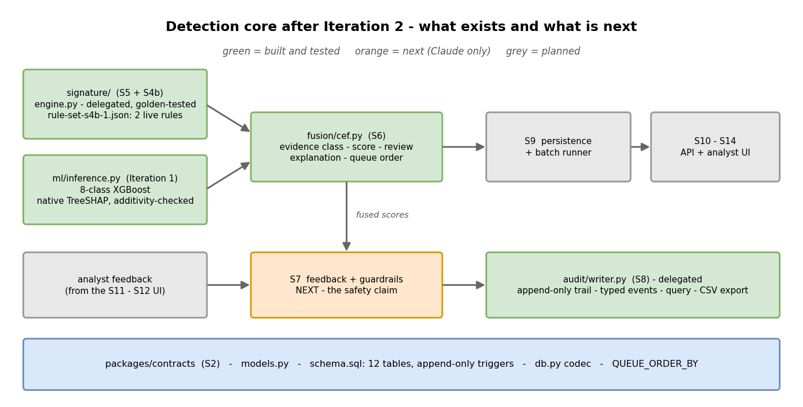
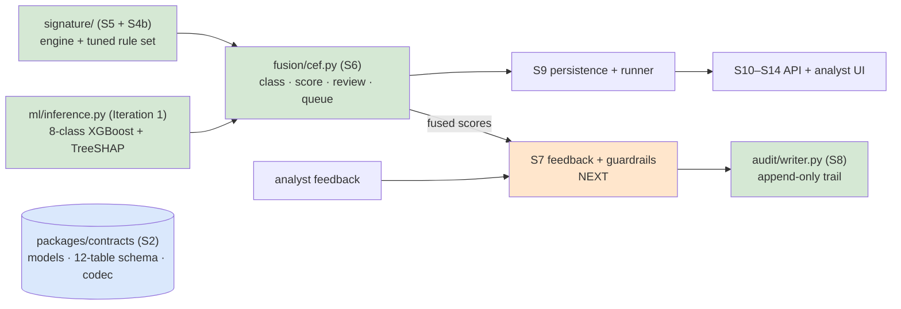
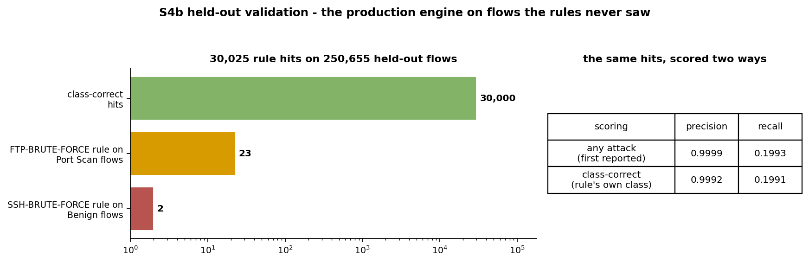
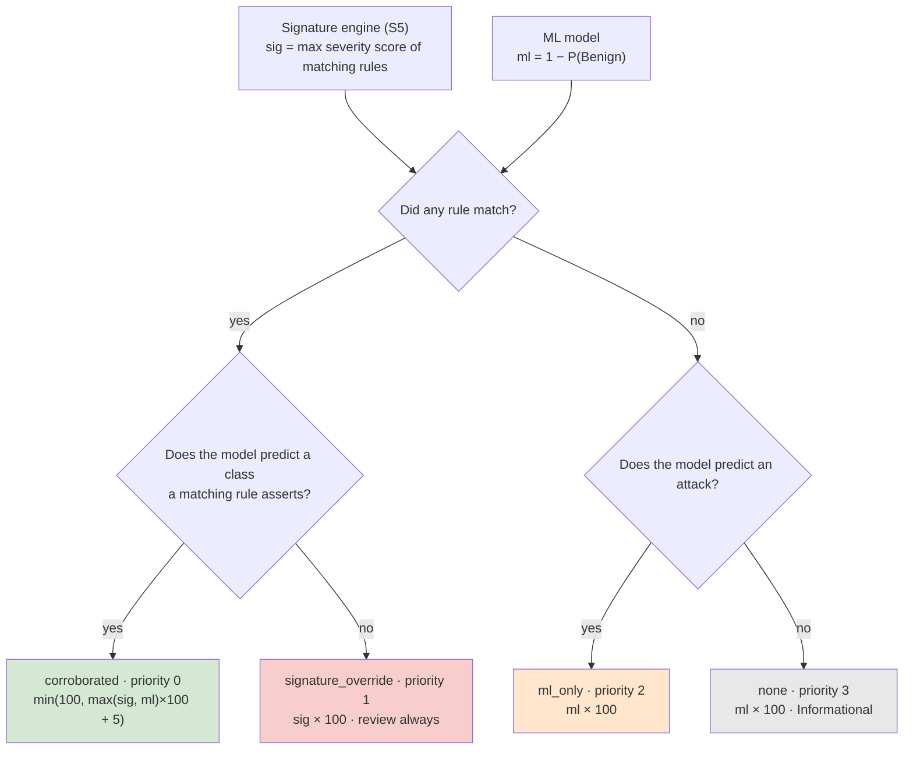
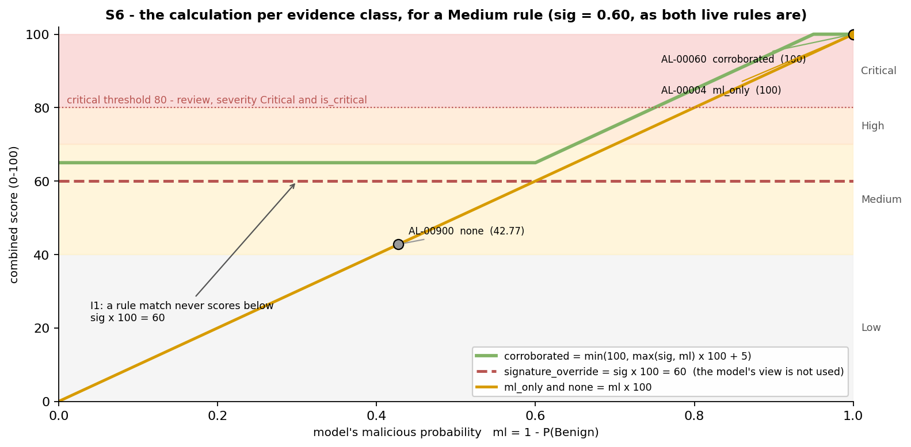
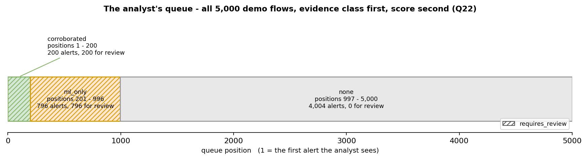
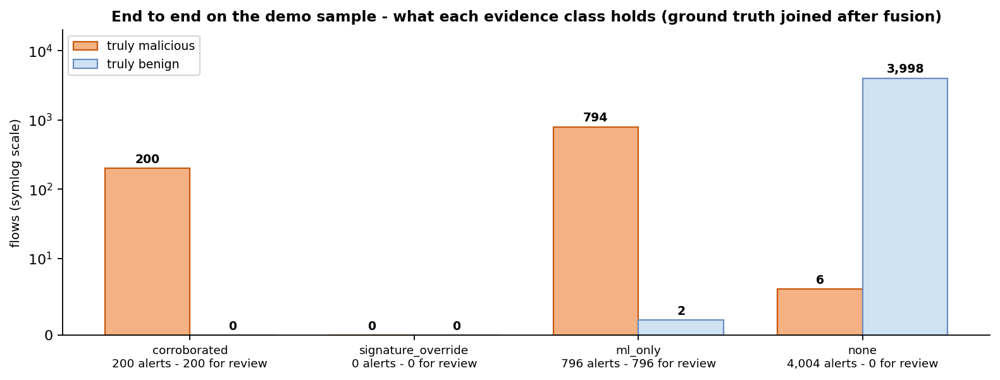

# Iteration 2 Report — The Detection Core

**Branch:** `feat/s6-fusion` (local) · **Shared for collaborators:** `feat/s2-contracts` on GitHub
**Period:** 2026-09-11 · **Status:** S2, S5 + S4b, S8 and S6 complete · **187 tests pass**

Iteration 1 established what is true about the data and the detectors. Iteration 2 builds the
detection core on that footing: the data contract every later step uses, the signature engine and
its tuned rules, the append-only audit trail, and — the centrepiece — the new logic that
**combines** signature and model evidence into one ranked, explained analyst queue.

Every figure below is produced by code in this repository and can be regenerated (§10).

---

## 1. What was built



<details>
<summary>Mermaid source (for viewers that render it)</summary>



</details>

| Step | What it delivers | Built by | Evidence |
|---|---|---|---|
| **S2** data contracts | Pydantic models, a 12-table SQLite schema with TDM column names, append-only triggers, row codec | Claude | 53 contract tests, including a real-data test over 5,000 TreeSHAP records |
| **S5** signature engine | Python port of the legacy JavaScript engine | DeepSeek worker, reviewed | Reproduces the JS output on **all 1,000** legacy flows |
| **S4b** tuned rule set | `rules/rule-set-s4b-1.json` + a committed held-out re-test | Claude | Demo and held-out figures reproduced through the production engine |
| **S8** audit writer | Typed, append-only audit trail with query and CSV export | DeepSeek worker, reviewed | 45 tests; the database refuses every rewrite |
| **S6** fusion | The combination logic, §4 | Claude only | 22 tests; invariants I1, I2, I4, I5; all 5,000 demo flows end to end |

---

## 2. The data contract (S2)

The keystone: every later step reads and writes these types, so they were made strict now, while
changing them is still cheap.

- **12 of the TDM's 13 tables**, with TDM column names, so the later PostgreSQL move is mechanical.
  Every departure is marked `DEVIATION` in the code and logged in the changelog (v1.5); a test
  fails on any unlogged column.
- **Append-only audit log and feedback history**, enforced by database triggers — including a guard
  the TDM's design lacks: in SQLite, `INSERT OR REPLACE` silently deletes a row without firing
  delete triggers. A test proves the guard holds even on a connection with no special settings.
- **Evidence-class rules are enforced twice** — in the Python models and as database `CHECK`
  constraints — so no writer can store an alert whose class contradicts its evidence.
- **Ground truth is kept out of the schema entirely.** Label fields are refused at the door; the
  analyst never sees the answer key.
- **A bug caught in time:** timestamps were stored as text of varying width, which sorts wrongly
  (`12:00:00.5Z` before `12:00:00Z`). They are now fixed-width, so text order is time order.

---

## 3. The signature layer (S5 + S4b)

### The live rules

Rules test 16 "observable" flow fields — the view the thresholds were tuned in, defined once in
`packages/detection/signature/observable.py`. Five legacy rules are **retired, not deleted**: their
best achievable precision was too low to trust.

| Rule | Conditions (all must hold) | Severity | Demo sample |
|---|---|---|---|
| `SIG-FTP-BRUTE-FORCE` | TCP · destination port 21 · ≥ 10 packets/s · **≥ 1 forward packet** (tuned) · ≤ 5 s | Medium | 146 hits, 146 correct |
| `SIG-SSH-BRUTE-FORCE` | TCP · destination port 22 · **≥ 10.66689 packets/s** (tuned) · ≥ 10 forward packets · ≤ 5 s | Medium | 54 hits, 54 correct |

Each condition is **checkable by a human against the flow record** — the reason the signature layer
exists (Iteration 1, v1.3). Every match records the observed value beside each threshold.

### Held-out validation — one set of hits, two honest scorings



Re-run through the production engine on 250,655 flows the rules never saw: **30,025 hits** —
exactly the count first reported.

| Scoring | Precision | Recall | Wrong hits |
|---|---:|---:|---:|
| **Any attack** — a hit is right if the flow is an attack (the figures first reported) | **0.9999** | **0.1993** | 2 |
| **Class-correct** — the flow must be the rule's own attack type | **0.9992** | **0.1991** | 25 |

**The finding:** 23 NMAP port scans against TCP port 21 satisfy the FTP rule, because its tuned
clause (≥ 1 forward packet) is loose. They are attacks, so not false alarms — but wrongly
*labelled*. That directly shaped the fusion logic below.

---

## 4. The new combination logic (S6)

Fusion decides, for every flow, **which evidence class it belongs to, what score it gets, whether
a human must review it, and where it sits in the analyst's queue.** It is a pure function: the same
inputs always give the same decision, with no clock and no randomness.

### 4.1 The decision


<details>
<summary>Mermaid source (for viewers that render it)</summary>



</details>

### 4.2 The calculations

**Inputs**

| Symbol | Meaning | Calculation |
|---|---|---|
| `sig` | Strength of the signature evidence | The highest severity score among the matching rules: Low 0.40 · Medium 0.60 · High 0.80 · Critical 0.95. 0 when no rule matched |
| `ml` | The model's probability that the flow is malicious | `1 − P(Benign)`, from the model's eight class probabilities |
| predicted class | What the model thinks the flow is | The most probable of the eight classes |

**Per evidence class**

| Evidence class | When | `combined_score` (0–100) | Needs review | Queue priority |
|---|---|---|---|---|
| `corroborated` | A rule matched **and** the model predicts that rule's class | `min(100, max(sig, ml) × 100 + 5)` | when score ≥ 80 | **0** (first) |
| `signature_override` | A rule matched, but the model disputes its class | `sig × 100` | **always** | 1 |
| `ml_only` | No rule matched; the model predicts an attack | `ml × 100` | when score ≥ 80 | 2 |
| `none` | Neither detector flagged the flow | `ml × 100` | no | 3 (last) |

The `+ 5` is the agreement bonus; a rule and the model agreeing is worth a little more than
either alone. Scores are rounded to two decimals, as the database stores them. If the model's
prediction is unavailable for a flow, that flow is always sent for review.

**Severity** — one threshold, 80 (the guardrails' `critical_alert_threshold`), drives three things
at once, so they can never disagree:

| Score | Severity | `is_critical` | Review (corroborated / ml_only) |
|---|---|---|---|
| ≥ 80 | Critical | yes | yes |
| 70 – 80 | High | no | no |
| 40 – 70 | Medium | no | no |
| < 40 | Low | no | no |
| any, class `none` | Informational | — | no |



The chart plots the score formulas for a Medium rule (`sig` = 0.60, the severity of both live
rules) against the model's malicious probability. Three properties are visible:

- **Agreement is never worse than either detector alone.** The green line never drops below the
  flat red line or the orange diagonal.
- **A disputed rule is not averaged away.** It scores `sig × 100` = 60 however strongly the model
  disagrees — and is always reviewed. Averaging (the TDM's original weighted sum) would bury it.
- **The model alone is taken at face value** — the diagonal — but it carries no checkable reason.

### 4.3 What changed from the original design (notebook 03)

The evidence classes, formulas and invariants come from notebook 03. Three things changed, each
driven by evidence:

| | Notebook 03 | Now | Why |
|---|---|---|---|
| **Corroboration** | Rule matched **and** the model says "attack" | Rule matched **and** the model predicts **the rule's class** | The 23 port scans (§3): a rule the model contradicts is not agreement. That case is now `signature_override` — reviewed, never quietly ranked as confirmed |
| **Model probability** | Confidence in the predicted class | `1 − P(Benign)` | Confidence understates risk when the model splits probability between attack classes. Example: DoS 0.50 + DDoS 0.45 + Benign 0.05 → old **0.50**, new **0.95**. The old data had no per-class probabilities |
| **Severity** | Legacy bands; "Critical" at ≥ 90, separate from the TDM's 80 | One threshold, 80, for severity, `is_critical` and review | Three signals that could contradict each other now cannot |

### 4.4 Worked examples — real demo alerts

**`AL-00060` → `corroborated`, score 100, Critical, review**

| | |
|---|---|
| Rule | `SIG-SSH-BRUTE-FORCE`, Medium → `sig` = 0.60. Observed: TCP · port 22 · **120.318 packets/s** (≥ 10.667) · 23 forward packets (≥ 10) · 382,320 µs (≤ 5,000,000) |
| Model | Brute Force; `P(Benign)` ≈ 0.0000015 → `ml` = 0.99999854 |
| Calculation | `min(100, max(0.60, 0.99999854) × 100 + 5)` = `min(100, 104.99985)` = **100.00** |
| Result | Class agrees → `corroborated`; 100 ≥ 80 → Critical and review; queue priority 0 |

The analyst sees why, in words: *"A signature rule and the model agree on Brute Force. The rule's
conditions below can be checked against the flow. Rule SIG-SSH-BRUTE-FORCE: Protocol is TCP
(observed TCP); Destination port is 22 (observed 22); Flow packets per second is at least 10.667
(observed 120.318) … Strongest model evidence for Brute Force: Dst Port = 22 (+5.562) …"*

**`AL-00004` → `ml_only`, score 100, Critical, review**

| | |
|---|---|
| Rule | none matched |
| Model | DoS; `ml` = 0.9999995 |
| Calculation | `0.9999995 × 100` = 99.99995 → **100.00** |
| Result | `ml_only`; review; queue priority 2 — after every corroborated alert, whatever the score |

**`AL-00900` → `none`, score 42.77, Informational, no review**

| | |
|---|---|
| Model | Benign at 0.572 → `ml` = 1 − 0.57233 = 0.42767 |
| Calculation | `0.42767 × 100` = **42.77** |
| Result | No detector flagged it → `none`; Informational; the bottom of the queue |

**Illustrative → `signature_override`, score 60, review** *(no demo alert falls in this class)*

| | |
|---|---|
| Rule | `SIG-FTP-BRUTE-FORCE` matches an NMAP probe of port 21 (the §3 finding) → `sig` = 0.60 |
| Model | Port Scan, confident |
| Calculation | The classes disagree → `sig × 100` = **60** — the model's number is deliberately not used |
| Result | Always reviewed; ranked above every `ml_only` alert. The analyst sees a checkable rule and a model that disagrees, and decides |

### 4.5 The guarantees

| | Invariant | How it is proven |
|---|---|---|
| **I1** | A rule match never scores below `sig × 100` | Checked over a grid of every severity, model class and probability |
| **I2** | `signature_override` is always reviewed | Same grid |
| **I3** | Feedback cannot lower a `signature_override` alert | Belongs to S7's guardrails — kept as an explicit, named placeholder test |
| **I4** | Fusion is a pure function | Same inputs, rebuilt independently, give identical decisions |
| **I5** | No `signature_override` ranks below any `ml_only` | Sorting the grid's decisions; and on the demo, the database's own `ORDER BY` |

---

## 5. The analyst's queue



**Order:** evidence class first, score second — `ORDER BY evidence_priority, combined_score DESC`.
The class order (`corroborated` → `signature_override` → `ml_only` → `none`) was **decided by the
project lead** (Q22).

Class comes first because scores from different evidence classes are not comparable. The first
design sorted a mixed queue by score alone, and it ranked the alerts that mattered most **#414 of
417** — a precision-1.000 rule's 60 sorted below a model's 85. Class-first ordering is the fix, and
the test suite checks that the database serves exactly the order the code intends, alert for alert.

---

## 6. End to end on the demo sample



All 5,000 demo flows, through the real rule engine, the real model output and the fusion step.
Ground truth is joined only afterwards, for this evaluation.

| Evidence class | Alerts | Truly malicious | Truly benign | Reviewed | Queue positions |
|---|---:|---:|---:|---:|---|
| `corroborated` | **200** | 200 | 0 | 200 | 1 – 200 |
| `signature_override` | **0** | — | — | — | — |
| `ml_only` | **796** | 794 | 2 | 796 | 201 – 996 |
| `none` | **4,004** | 6 | 3,998 | 0 | 997 – 5,000 |

- **Every corroborated alert is a real attack**, and they are the first 200 things the analyst sees.
- **Only 2 benign flows reach the review queue** (both `ml_only`); 6 attacks are missed by both
  detectors — the honest residual Iteration 1 reported.

> **Read this with care.** Every flagged flow scores between 81.3 and 100, so on this data the
> critical threshold never separates flagged alerts: "needs review" and "flagged" coincide. That is
> the model's near-certainty on a testbed where each attack type came from one tool — the same
> artefact behind its 0.99 F1 — not a property of the fusion design. On real traffic the scores
> would spread, and the threshold would begin to discriminate.

---

## 7. The audit trail (S8)

Every login, detection run, feedback event, guardrail decision, rule change and configuration
change becomes a typed, append-only record with its actor, timestamp and rationale (NFR-02/03).
The writer has no update or delete path at all, and the database refuses one anyway. It supports
filtering by actor, event type, alert and time range, and CSV export.

---

## 8. How the work was split

Bulk implementation was delegated to cheaper model workers; design, contracts, fusion and every
review stayed with Claude, as the project's rules require. **No worker output was accepted on its
own word** — only on reading its code and running the full test suite.

| Worker | Task | Accepted because |
|---|---|---|
| DeepSeek | S5 signature engine + golden tests | It reproduced the JS engine on all 1,000 legacy flows; its four deliberate divergences each make bad input fail rather than pass |
| DeepSeek (isolated copy of the repo) | S8 audit writer + tests | Parameterised SQL throughout, no mutate path, 45 tests including the timestamp edge |
| — | S2, S4b, S6 | Not delegable: contracts and fusion logic |

---

## 9. Where the project stands


**Next: S7 — feedback and guardrails**, the plan's highest-risk step: it is where the promise that
analyst feedback can never silence a critical alert is proven. It inherits two things from S6:

- **Invariant I3** — feedback cannot lower a `signature_override` alert.
- **A floor decision to record** — "Critical" now means a score of 80 or more (the legacy code used
  90), which widens the alerts the critical floor protects.

### Carried risks

| Risk | Severity | Mitigation |
|---|---|---|
| The model's 0.99 F1 is a testbed artefact | **High** | Stated in every report; §6 shows its effect on the queue |
| The FTP rule labels port scans on port 21 as brute force | Medium | Fusion sends rule–model disagreements to review (§4.3) |
| Scores barely spread on this data, so the threshold does little | Medium | Reported, not hidden (§6) |
| 6 attacks missed by both detectors | Low | Honest residual; feeds rule development |

---

## 10. Reproducing everything here

```bash
cd hitl-ids
python -m pytest                          # 187 pass, 1 deliberate skip (I3 -> S7)
python scripts/write_rule_set.py          # rules/rule-set-s4b-1.json
python scripts/validate_rule_set.py       # data/processed/rule_set_validation.json (demo + held-out)
python scripts/fusion_demo_summary.py     # data/processed/fusion_demo_summary.json
python scripts/make_diagrams.py           # docs/img/01-12
```

The held-out re-test and the fusion summary need regenerated data files; `data/README.md` lists
where each comes from and the order to rebuild them.

---

## Related documents

- [`system-workflow.md`](system-workflow.md) — the whole system end to end, from traffic capture to the dashboard's feedback loop
- [`iteration-report.md`](iteration-report.md) — Iteration 1: the corrected dataset and the direction change
- [`plan-changelog.md`](plan-changelog.md) — every decision with its evidence (v1.5 – v1.8 cover this iteration)
- [`HANDOVER.md`](HANDOVER.md) — the current state for the next session
- [`../data/README.md`](../data/README.md) — the data, its checksums, and how to rebuild it
- [`../packages/detection/fusion/cef.py`](../packages/detection/fusion/cef.py) — the fusion specification, in its docstring
