# Iteration Report — Corrected Dataset & Direction Change

**Branch:** `feat/corrected-dataset-and-findings` · **Period:** 2026-09-10 → 2026-09-11
**Status:** phase complete · 35 files, 209,205 insertions

This iteration did not build product features. It established **what is actually true** about the
data and the detectors, and in doing so reversed two of the project's central claims. That was the
right use of the time: every claim reversed here would otherwise have been reversed later, after
being built on.

---

## 1. What was built

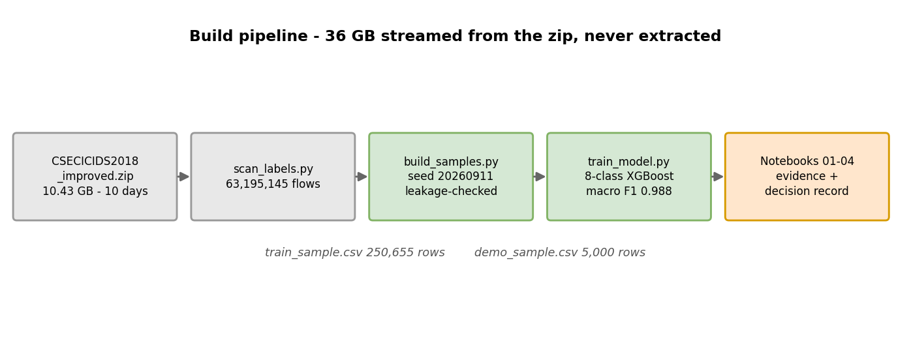

<details>
<summary>Mermaid source (for viewers that render it)</summary>

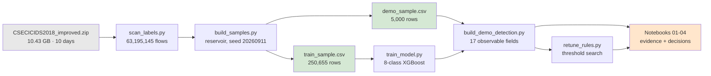

</details>

A hard rule throughout: the 36 GB of uncompressed CSV is **streamed from the zip**, never
extracted. Nothing but the two samples touches disk.

---

## 2. The dataset, as it actually is

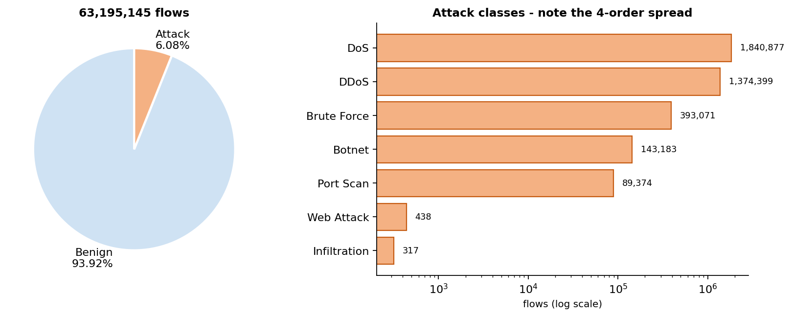

<details>
<summary>Mermaid source (for viewers that render it)</summary>

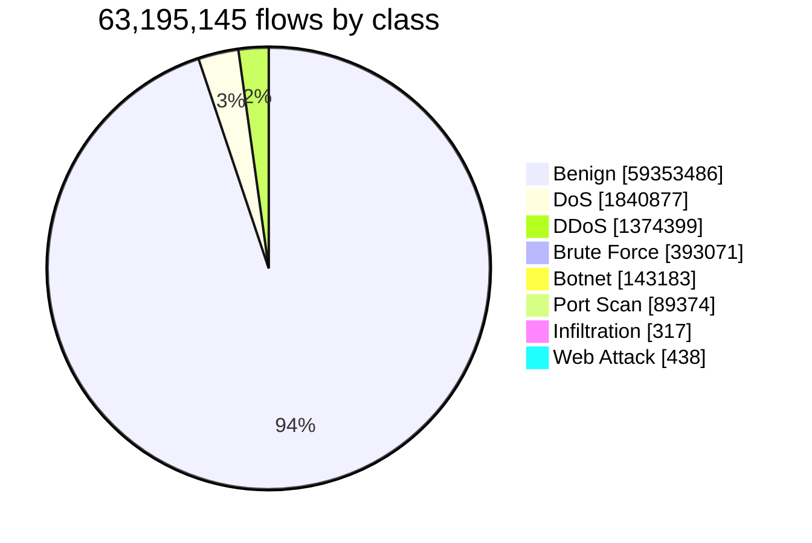

</details>

| Finding | Value | Why it matters |
|---|---|---|
| **Infiltration was never one class** | 99.6% is `NMAP Portscan`; true infiltration = **317 flows** | Explains why the literature calls Infiltration "unlearnable" — the label conflates reconnaissance with post-compromise activity |
| **FTP brute force never succeeded** | 298,874 flows, **100% attempted** | Makes the attempted/benign choice worth 76% of the Brute Force class |
| **Web Attack barely exists** | 283 successful in 63.2M (0.0004%) | The old 1,000-row sample held 83 of them — **29% of the entire class** |
| **Schema changed** | 91 columns, not 79 | 6 new columns; `CWE Flag Count` → `CWR Flag Count` fixes a typo the old model still carries |
| **Imbalance** | 93.9% benign | The old 50/50 sample was 15× more attack-dense than reality |

---

## 3. How the direction changed

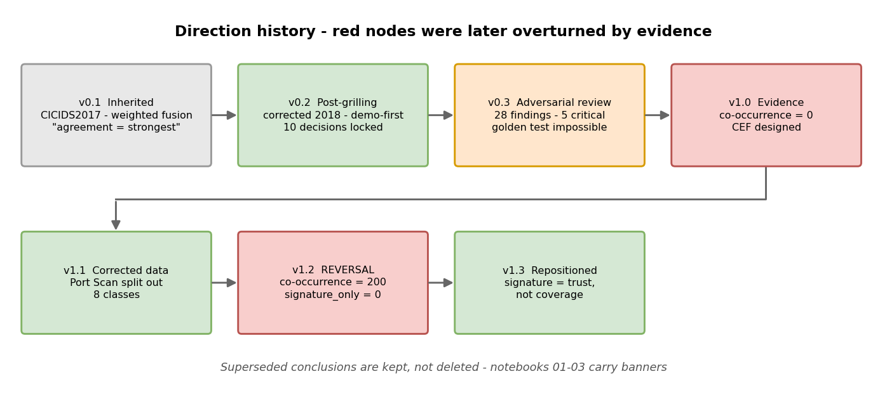

<details>
<summary>Mermaid source (for viewers that render it)</summary>

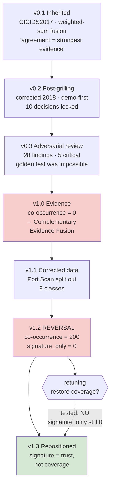

</details>

Red nodes are conclusions that were **later overturned by evidence**. They are kept in the record
rather than erased — notebooks 01–03 carry supersession banners and remain unchanged.

### The reversal, in numbers

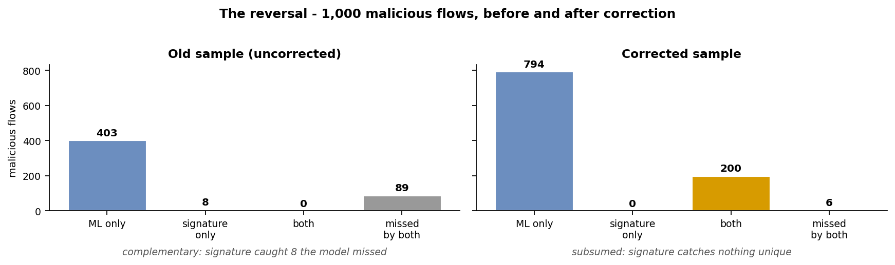

| | Old sample (v1.0 basis) | Corrected sample |
|---|---:|---:|
| Signature precision | 0.533 | **1.000** (after retuning) |
| Signature recall | 0.016 | **0.200** |
| Caught by ML only | 403 | 794 |
| **Caught by signature only** | **8** | **0** |
| **Caught by both** | **0** | **200** |
| Missed by both | 89 | 6 |

**Cause:** the new model is far stronger, not the rules. The old 6-class model was trained on
mislabelled data and called SSH brute force "Benign" at 0.78 confidence. A strong classifier
subsumes weak rules.

---

## 4. The model

| Class | Precision | Recall | F1 | Support |
|---|---:|---:|---:|---:|
| Benign | 1.000 | 1.000 | 1.000 | 20,000 |
| Botnet | 1.000 | 1.000 | 1.000 | 6,000 |
| Brute Force | 1.000 | 1.000 | 1.000 | 6,000 |
| DDoS | 1.000 | 1.000 | 1.000 | 6,000 |
| DoS | 1.000 | 1.000 | 1.000 | 6,000 |
| **Infiltration** | 0.979 | 0.855 | **0.913** | 55 |
| Port Scan | 1.000 | 1.000 | 1.000 | 6,000 |
| Web Attack | 1.000 | 0.987 | 0.993 | 76 |

**macro F1 0.9882 · weighted F1 0.9997**

> ### ⚠️ Do not present this as a capability claim
> Each attack class was generated by **one tool with fixed configuration**, so every class carries
> a near-constant flow fingerprint. The port-shortcut hypothesis was tested by ablation and
> **rejected** (removing `Dst Port` + `Protocol` costs only −0.0011 macro F1), which means the
> shortcut is the *flow shape itself*. These scores are honest on this data and **will not
> transfer to real traffic.**

---

## 5. Where the project now stands

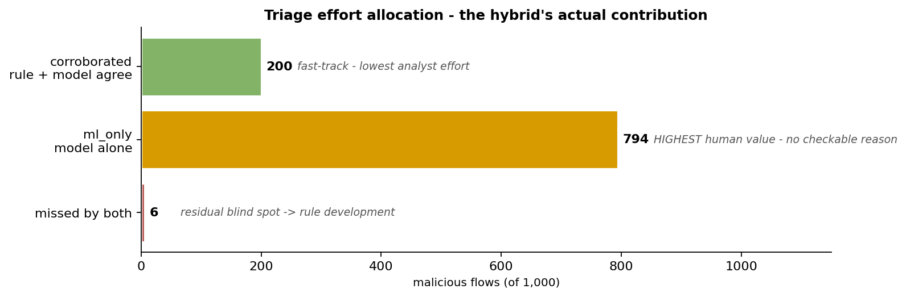

<details>
<summary>Mermaid source (for viewers that render it)</summary>

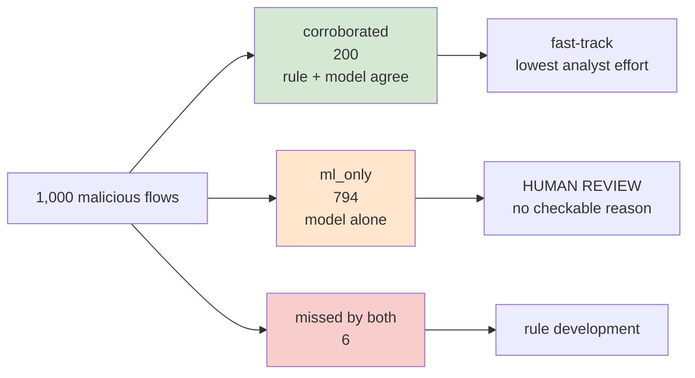

</details>

**The claim the project can now defend:** the hybrid does not detect *more* — it tells the analyst
**where their attention is worth spending**. When the signature layer fires it is right 100% of
the time and a human can verify *why*: `SSH on port 22, >10.67 pkt/s, ≥10 fwd packets, <5s` is
checkable against the flow record. `Bwd Packet Length Min contributed +0.31` is not — SHAP
explains the model, not the traffic.

That is a stronger thesis for a **human-in-the-loop** system than coverage ever was, and unlike
the two claims it replaces, it is true on this data.

---

## 6. How to proceed

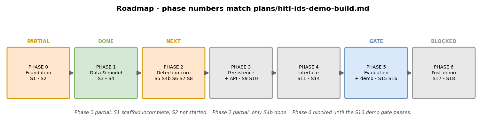

<details>
<summary>Mermaid source (for viewers that render it)</summary>

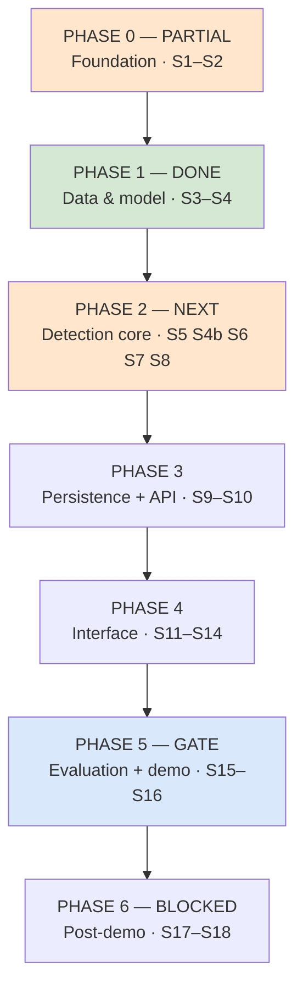

</details>

> ### Phase numbering — canonical
> **`plans/hitl-ids-demo-build.md` is the single source of truth** for phase numbers.
> An earlier draft of this report numbered them differently, which made "Phase 1 complete"
> ambiguous. The evidence work described here is **Iteration 1 — Evidence & Direction**, a
> *work iteration*, not a plan phase: it spans plan **Phase 1 plus step S4b**.
> Never describe the evidence work with a bare phase number.

### Immediate next steps, in dependency order

> **Held-out validation passed.** The tuned thresholds were re-tested on `train_sample.csv`
> (250,655 rows the rules had never seen — 50× the tuning set): combined precision **0.9999**,
> recall **0.1993**, two false positives in 30,025 hits. The overfitting risk is closed.

| # | Step | Why now | Owner |
|---|---|---|---|
| ~~1~~ | ~~Held-out re-test of rule thresholds~~ | **DONE** — precision 0.9999 / recall 0.1993 on 250,655 unseen rows. FTP recall even improved (0.730 → 0.760) | Claude |
| 2 | **S2 — data contracts** (12 tables, append-only audit) | Keystone; everything after depends on it, and it is expensive to change after persistence lands | Claude |
| 3 | **S5/S4b — signature engine + tuned rules in Python** | Golden-tested against frozen fixtures | Delegate + review |
| 4 | **S6 — fusion re-specification** | Evidence classes + queue ordering + invariants I1–I5 | Claude only |
| 5 | **S7 — feedback + guardrails** | The safety claim; never delegated | Claude only |
| 6 | S8–S9 — audit writer, SQLite, batch runner | | Mixed |

### Carried risks

| Risk | Severity | Mitigation |
|---|---|---|
| 0.99 F1 is a testbed artefact | **High** — invalidates any generalisation claim | State it in every report; never present as real-world capability |
| ~~Rule thresholds tuned on the demo sample~~ | **CLEARED** | Held-out re-test on 250,655 unseen rows: precision **0.9999**, recall **0.1993** — 2 false positives in 30,025 hits. Thresholds are not overfit. |
| Infiltration F1 rests on 55 held-out rows | Medium | Report the support count beside the metric |
| 5 rules retired (DoS/Botnet precision 0.000) | Medium | Documented as a finding, not a gap |
| 6 flows missed by both detectors | Low | Honest residual; feeds rule development |

### Explicitly out of scope until the demo gate passes

Flow exporter (CICFlowMeter fork), PostgreSQL migration, real JWT/RBAC, and the ~25 remaining
TDM endpoints. All are Phase 6.

---

## 7. Reproducing everything here

```bash
git checkout feat/corrected-dataset-and-findings
pip install nbformat nbconvert xgboost shap kagglehub pandas matplotlib scikit-learn

# the archive is gitignored (10.4 GB) - fetch it once
#   https://intrusion-detection.distrinet-research.be/CNS2022/Datasets/CSECICIDS2018_improved.zip
#   -> hitl-ids/data/raw/

cd hitl-ids/scripts
python scan_labels.py           # ~11 min, 63M flows
python build_samples.py         # ~12 min, seeded, leakage-checked
python train_model.py           # 8-class model
python build_demo_detection.py  # detection inputs + C1/C2/C3
python retune_rules.py          # threshold search

cd ../notebooks
for nb in 01_evidence_audit 02_signature_rule_feasibility 03_fusion_redesign 04_corrected_findings; do
  python -m jupyter nbconvert --to notebook --execute --inplace $nb.ipynb
done
```

Notebooks 01–03 read only the frozen fixtures and are reproducible **without** the archive.
Only notebook 04 needs the regenerated artifacts.

---

## Related documents

- [`plan-changelog.md`](plan-changelog.md) — v0.1 → v1.3, every change with its evidence
- [`feasibility-study.md`](feasibility-study.md) — method, limits, and where the process failed
- [`rule-retuning-report.md`](rule-retuning-report.md) — threshold search detail
- [`finding-infiltration-mislabelling.md`](finding-infiltration-mislabelling.md) — report-ready write-up of the Infiltration finding
- [`../../plans/hitl-ids-demo-build.md`](../../plans/hitl-ids-demo-build.md) — the 18-step build plan
- [`../notebooks/04_corrected_findings.ipynb`](../notebooks/04_corrected_findings.ipynb) — the executable decision record
