# Preliminary User Manual

**FYP-26-S3-13 — Human-in-the-Loop Intrusion Detection Dashboard**
CSIT321 Project · School of Computing and Information Technology

> **This file is the source; the submitted document is generated from it.** Edit the text here,
> then rebuild:
>
> `python scripts/build_user_manual.py --out docs/FYP-26-S3-13_PrelimUserManual_v0.2.docx`
>
> Always pass `--out` when an earlier `.docx` holds edits made in Word: a rebuild replaces the file
> it writes wholesale. The cover page still needs the assessor, supervisor, topic code and team rows
> filled in; they appear as bracketed placeholders.

---

## Document control

| | |
|---|---|
| Title | Preliminary User Manual |
| Document name | FYP-26-S3-13 Preliminary User Manual, Version 0.3 |
| Status | Draft for team review |

### Record of revision

| Date | Description | Section affected | Changes made by | Version after revision |
|---|---|---|---|---|
| 12 Sep 2026 | First draft: introduction, installation, key features, and the sixteen initial GUIs | 1–4 | Glenn | 0.1 |
| 14 Sep 2026 | Updated from the built console: the web interface is running, so section 4 shows screenshots of the real screens (workstation, overview and IP address page added); installation uses the pinned Python 3.11 environment | 1–4 | Glenn | 0.2 |
| 15 Sep 2026 | Sign-in is now real: three accounts with passwords replace the role picker, section 4.1 and the login screenshot updated | 4.1 | Glenn | 0.3 |

---

## (1) Introduction

This Preliminary User Manual takes a first-time user from a fresh clone to a running system, and then
through the screens they will actually use. It stays practical: install, first run, first verdict.

### (1.1) What this manual covers

- Initial installation on Windows and macOS.
- First-time configuration and building the demo database.
- A tour of the interface: the analyst workstation and queue, one alert's evidence, the feedback loop
  and its guardrails, and the administrator and evaluator views.

### (1.2) What we assume about the readers

- Basic familiarity with opening a terminal and running simple commands.
- The reader can clone a repository from GitHub and open it in an editor.
- No security-operations background is assumed. Where a term matters — *evidence class*, *queue
  band*, *guardrail* — the manual explains it at the point of use.

### (1.3) Scope and purpose

This project is a **network intrusion detection dashboard with a human in the loop**. Signature rules
and a machine-learning classifier score recorded network flows; an analyst reviews the resulting
alerts, and their verdicts re-rank future alerts inside safety limits the analyst cannot override.

This manual covers **initial installation, initial configuration, and the initial GUIs only**. It is
not a complete operator's guide.

> **What is built.** The detection pipeline, the feedback loop, the guardrails, the persistence layer,
> the evaluation harness, the API and the web console are **built and tested**. Every screen in
> section 4 is a screenshot of the running console against the demo database, taken automatically, so
> every score, rule and figure in it is the system's own. The one exception is marked where it appears.

---

## (2) The initial installation instructions

### (2.1) Prerequisites

**System requirements**

- **Python 3.11.** The tested library versions are pinned in `requirements.txt` for this version.
  Another Python can resolve different versions — on our development machine Python 3.12 picked a
  FastAPI and Starlette pair that fails at start-up — so create the environment from 3.11.
- **Node.js 18 or newer**, for the web console.
- **Git**, to clone the repository.
- Roughly **2 GB of free disk space** for the model, the sample data and the demo database.

**Main Python packages** (exact versions in `requirements.txt`)

| Package | Used for |
|---|---|
| `pydantic` | the data contracts every component validates against |
| `xgboost` | the 8-class classifier |
| `scikit-learn`, `numpy`, `pandas` | training and evaluation |
| `fastapi`, `uvicorn` | the API the console talks to |
| `pytest` | the test suite |

### (2.2) Backend set-up

Every Python command runs from the `hitl-ids` folder — the one containing `apps`, `packages` and
`pyproject.toml`. From anywhere else the API fails with `No module named 'apps'`.

**Windows (Command Prompt)**

```
git clone https://github.com/CSIT-321/CSIT321-Human-in-the-loop_IDS.git
cd CSIT321-Human-in-the-loop_IDS\hitl-ids
py -3.11 -m venv .venv
.venv\Scripts\activate
python --version
python -m pip install -r requirements.txt
```

`python --version` must print 3.11. If `py -3.11` is not found (`py -0p` lists the versions the
launcher knows), use the full path to a Python 3.11 `python.exe` in its place.

**macOS / Linux**

```
git clone https://github.com/CSIT-321/CSIT321-Human-in-the-loop_IDS.git
cd CSIT321-Human-in-the-loop_IDS/hitl-ids
python3.11 -m venv .venv
source .venv/bin/activate
python -m pip install -r requirements.txt
```

Activate the environment in every new terminal before running Python commands.

**Check the install before going further**

```
python -m pytest
```

Expect **411 passed, 0 skipped**.

**Build the demo database**

The database is not committed — it is 42 MB and fully regenerable. Build it once, and again before
every demonstration, because verdicts recorded on it are permanent:

```
python scripts/run_detection.py
```

This scores 5,000 recorded flows through the signature rules, the model and the fusion layer, and
writes `data/demo.db` in about **21 seconds**: 5,000 flows in, 5,000 alerts out.

**Run the API** (leave this terminal open)

```
python -m uvicorn apps.api.main:app
```

**http://localhost:8000/api/health** confirms which database is being served, and
**http://localhost:8000/docs** lists every operation interactively.

### (2.3) Frontend set-up

In a second terminal:

```
cd hitl-ids/apps/web
npm install
npm run dev
```

Open **http://localhost:5173**. The development server forwards `/api` to the API on port 8000, so
both servers must be running: if the API is not, the pages load but every panel reports that it
cannot reach the API.

Optional checks, from the same folder: `npm test` runs the 126 interface tests, and `npm run e2e`
plays the whole demonstration in a real browser against its own copy of the database.

---

## (3) Key features

- **Two detectors, kept separate on purpose.** Signature rules give a checkable reason; the model
  gives coverage. Their outputs are never averaged — a rule's verdict and a probability are not the
  same kind of evidence, so the system reports which kind it has rather than blending them into one
  misleading number.
- **Every flow becomes an alert**, including the ones nothing flagged. They form the bottom of the
  queue and the denominator of every measurement.
- **A ranked queue, not a list.** Alerts sit in bands — Tier 2 candidate, corroborated, model-only,
  nothing-flagged — and are ordered within a band by score.
- **An analyst workstation**: the queue, the selected alert and its context in one view, with
  keyboard triage, claim-and-close status actions and a notes thread.
- **Explanations, not scores alone.** Every model prediction carries a TreeSHAP explanation naming
  the measurements that drove it. All 5,000 pass an additivity check, meaning the explanation
  accounts for the prediction exactly.
- **Context from the recording only**: an overview of when traffic was captured and who talked most,
  and a page per IP address. No geolocation or threat-intelligence panels, because the recording
  holds none.
- **Analyst feedback that actually changes the queue.** A verdict adjusts the alert's operational
  score and — once three analysts agree — carries to the alerts like it.
- **Guardrails the analyst cannot override.** Caps on how far one verdict may move a score, floors
  under Critical and Infiltration alerts, and a rule that a signature-backed alert can never be
  decayed by feedback at all. Every intervention is shown to the analyst in words.
- **An append-only audit trail**, enforced by the database rather than by convention.
- **A three-arm evaluation** — no feedback, scripted feedback, and guardrails disabled — so every
  claim is a delta against a control rather than an assertion.
- **Three roles**: security analyst, system administrator, evaluator.

---

## (4) Initial GUIs of our project

Every screen below is a screenshot of the running console, captured against a disposable copy of the
demo database. Screens are shown in the order a demonstration visits them.

### (4.1) Sign in — one account per view

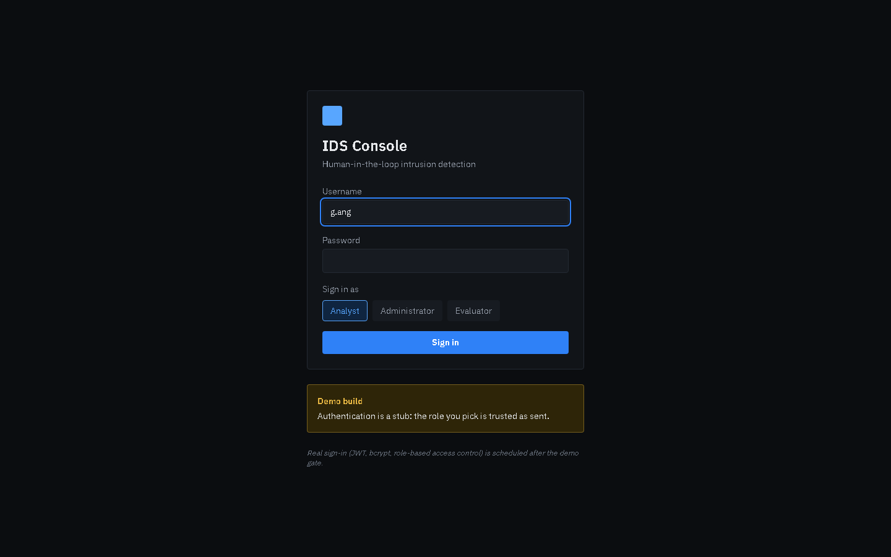

The first screen. The user signs in with a username and password; the account decides which views
are available. The system ships with three accounts, one per role:

| Account | Password | View |
|---|---|---|
| `g.ang` | `analyst-demo` | Security analyst — the workstation and queue |
| `admin` | `admin-demo` | System administrator — status, guardrails, audit trail |
| `evaluator` | `evaluator-demo` | Evaluator — scenarios and three-arm comparisons |

Sign-in is real: passwords are checked against bcrypt hashes, the server issues a signed token, and
every request carries it — a user cannot reach another role's views by choosing a role, because
there is no role to choose. Only an administrator can change the guardrail settings, for example.
To see another view, sign out and sign in as that account's user; a sign-in lasts eight hours.

### (4.2) The analyst workstation

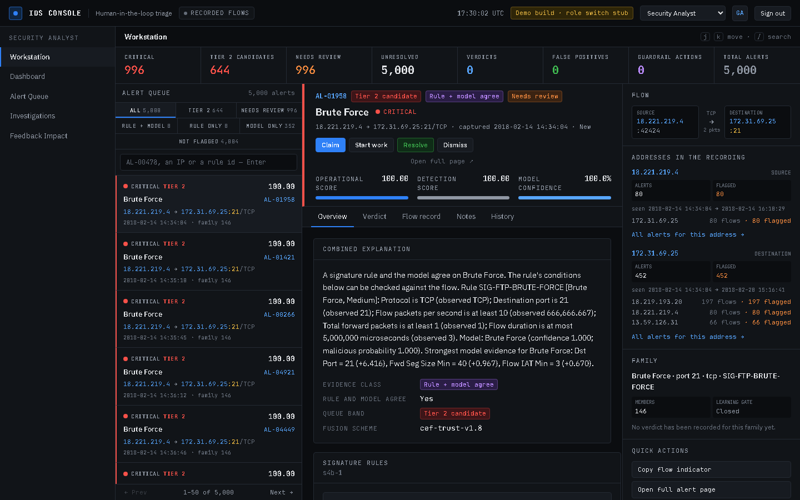

Where an analyst lands and spends a shift. Three columns: the **alert queue** on the left, the
**selected alert** in the centre, and its **context** on the right. Above them, a strip of counts —
Critical, Tier 2 candidates, needs review, unresolved, verdicts, false positives, guardrail actions
and total alerts — and a *Recorded flows* badge, because these are recorded lab flows, not a live feed.

Tabs above the queue filter it by band; the search box finds a record, an address or a rule; `j` and
`k` move through the list and the centre follows.

### (4.3) Working an alert in the workstation

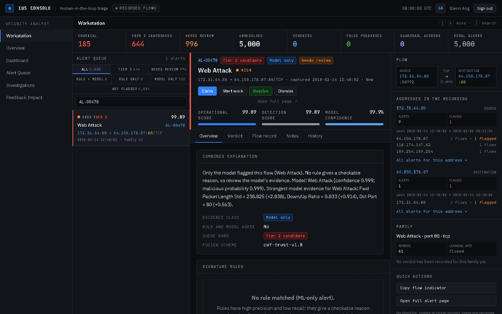

`AL-00478` selected. The header shows its band, evidence and severity, and three meters: the
**operational score** (feedback moves it), the **detection score** (fixed) and the **model's
confidence**. The context rail draws the flow, shows what the recording holds about both addresses,
and summarises the alert's family.

**Claim**, **Start work**, **Resolve** and **Dismiss** manage the alert's status and owner. They are
written to the audit trail and **never move a score**: status is workflow, and only a verdict is a
judgement.

### (4.4) Notes

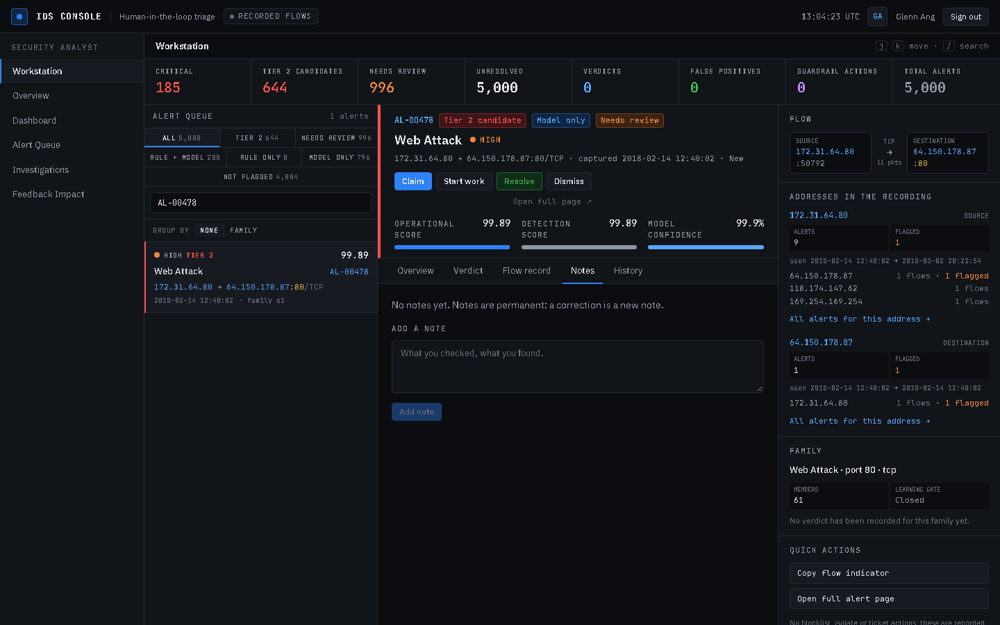

Each alert keeps a notes thread with the author and time on every note. Notes are permanent — a
correction is a new note — because an investigation record that can be edited is not a record.

### (4.5) Analyst dashboard

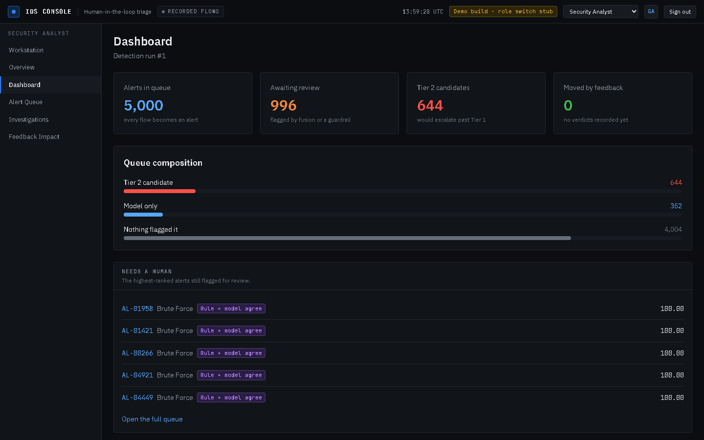

A summary of the current detection run: how many alerts exist, how many are flagged for review, how
many would escalate past Tier 1, and how many have been moved by human feedback so far. *Queue
composition* shows where the alerts sit; *Needs a human* lists the highest-ranked alerts still
awaiting review. "Moved by feedback" reads **0** until somebody records a verdict.

### (4.6) Overview

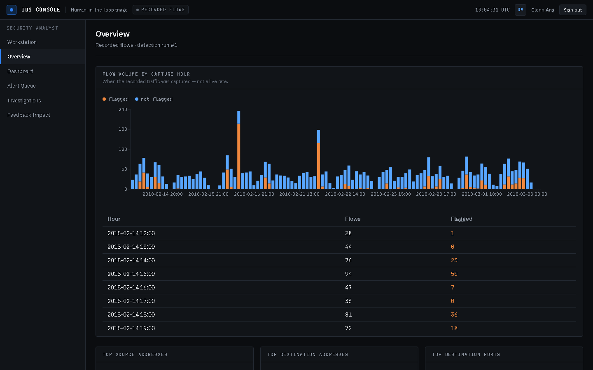

When the recorded traffic was captured and who took part in it. The histogram has one bar per hour of
the recording, with the flagged share at its base; below it are the busiest source and destination
addresses, the busiest destination ports, alerts by predicted class, the verdicts in force, triage
status and guardrail interventions. Every chart is repeated as a table.

### (4.7) One IP address

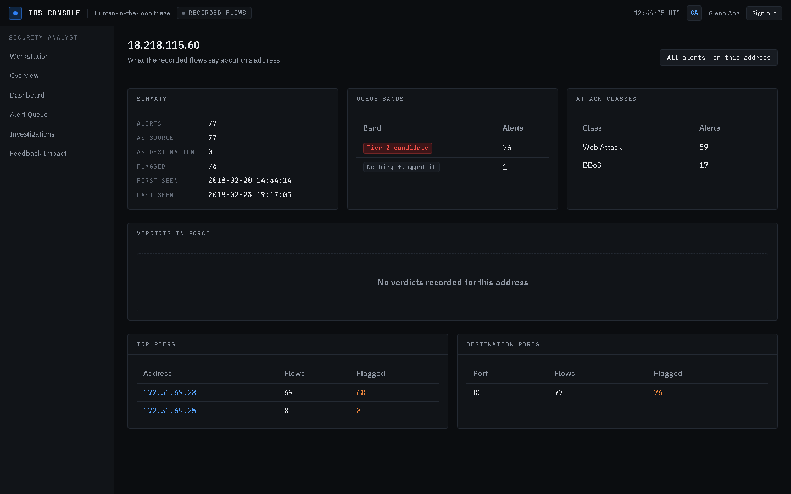

Everything the recorded flows say about one address — here `18.218.115.60`, the source of the Web
Attacks the demonstration opens on: its alert count, how many were flagged, when it was first and last
seen, its queue bands, attack classes and verdicts, its top peers and destination ports. Each peer
opens its own page, and *All alerts for this address* opens the workstation searched for it.

### (4.8) The alert queue

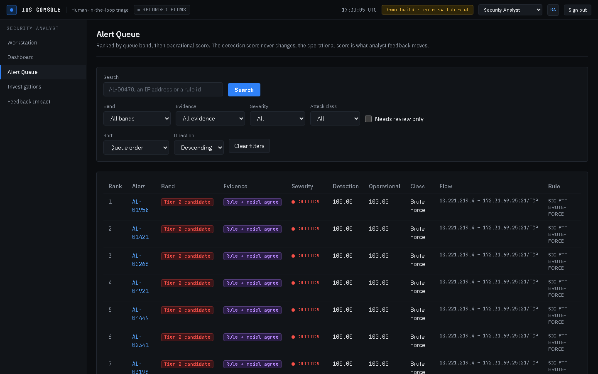

The full ranked table of 5,000 alerts. Each row shows the queue band, the alert reference, **both
score columns**, the predicted class, the flow and which rule fired.

The two score columns matter. **Detection** is what the detectors produced and never changes.
**Operational** is what analyst feedback moves. Showing both is what makes the human's effect visible.
Filters narrow the queue by band, evidence, severity and class, and live in the address bar, so a
filtered view survives a refresh.

### (4.9) Alert detail — the four evidence panels

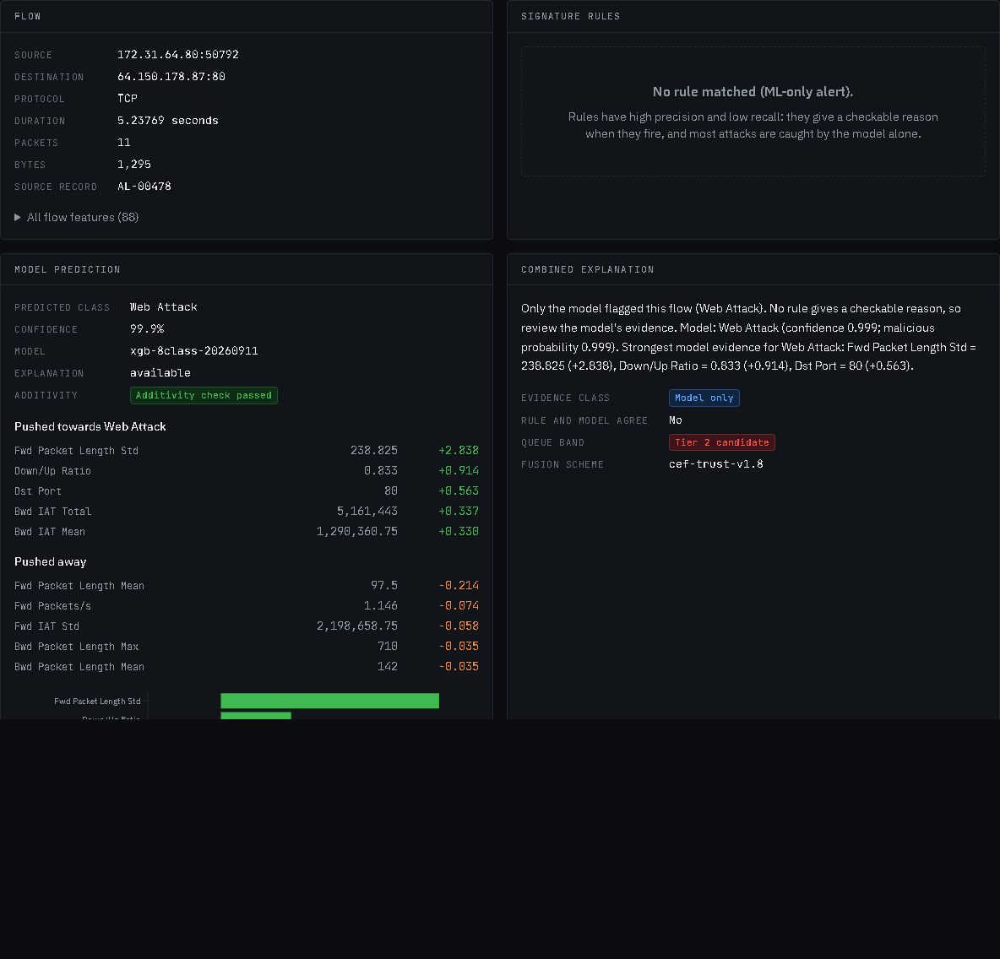

Everything the system knows about one alert, in four panels.

1. **Flow** — what actually crossed the wire.
2. **Signature rules** — what a hand-written rule could confirm. Here nothing matched, and the panel
   says so rather than showing an empty box.
3. **Model prediction** — the class, the confidence, and the measurements that pushed the prediction
   towards its class and away from it. Showing only the supporting evidence would be advocacy rather
   than explanation.
4. **Combined explanation** — why the alert sits where it does, in a sentence the analyst can repeat
   in a handover.

The model is 99.9% sure `AL-00478` is a Web Attack. It is in fact benign. The panels inform the
decision; they do not make it.

### (4.10) Signature evidence

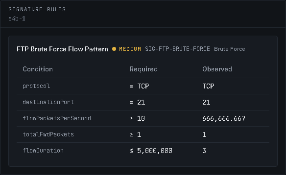

When a rule does fire — here on `AL-01958` — the panel lists every clause the rule requires beside the
value this flow actually had. An analyst can check the match in seconds without trusting anything.
The rules have high precision and low recall: they are there to give a *reason*, not to catch
everything.

### (4.11) Recording a verdict

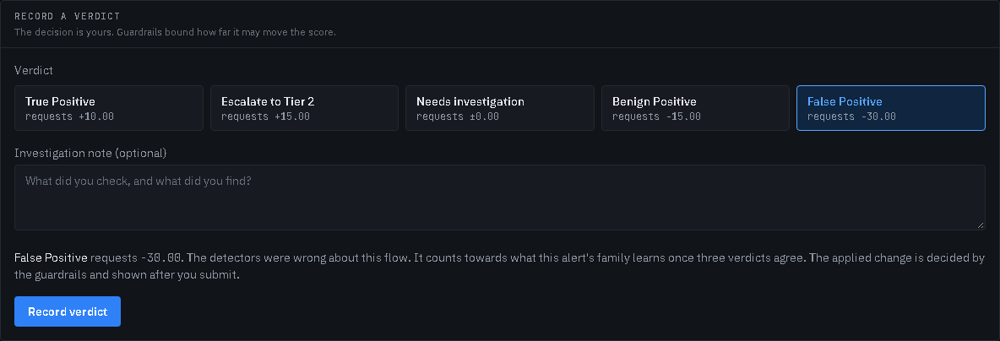

Five verdicts, with the closing labels security teams use: **True Positive**, **Escalate to Tier 2**,
**Needs investigation**, **Benign Positive** and **False Positive**. Each shows the score change it
requests before the analyst commits, and an optional note is recorded alongside. A new verdict
replaces the previous one rather than stacking on it.

### (4.12) The score adjustment chain

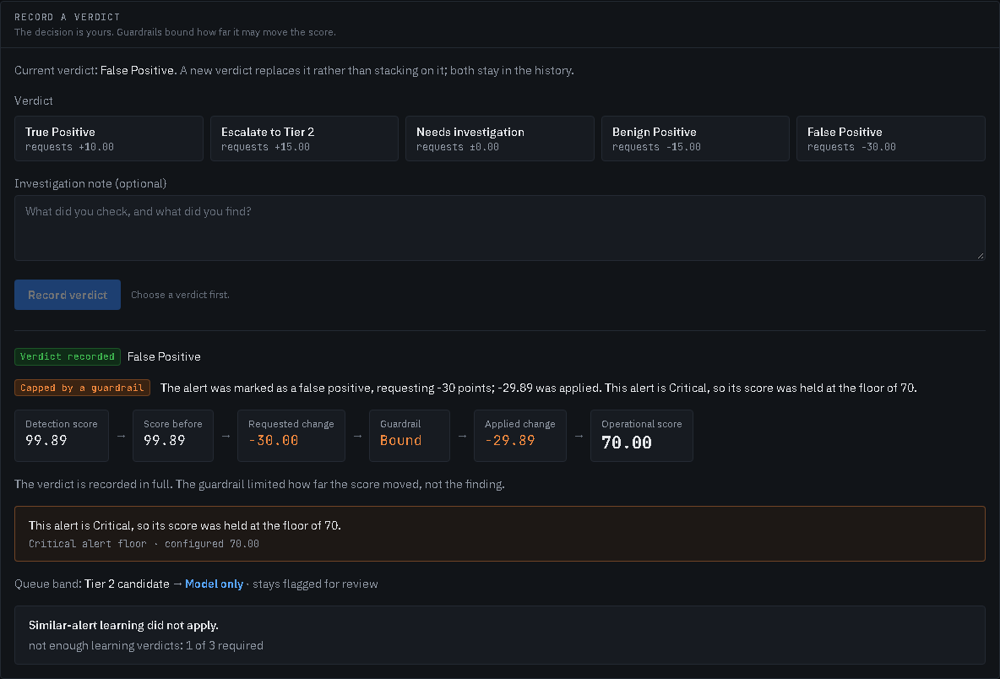

**The screen the project turns on.** It shows the whole chain — the detection score, what the analyst
requested, which guardrail bound the change, what was actually applied, and the resulting operational
score.

Here the analyst asked for −30 on `AL-00478` at 99.89. The alert is Critical, so the floor held it at
**70**, and the guardrail explains itself in a sentence rather than a code. The verdict was still
recorded in full: the guardrail limited the *score change*, not the analyst's finding.

### (4.13) When a guardrail refuses outright

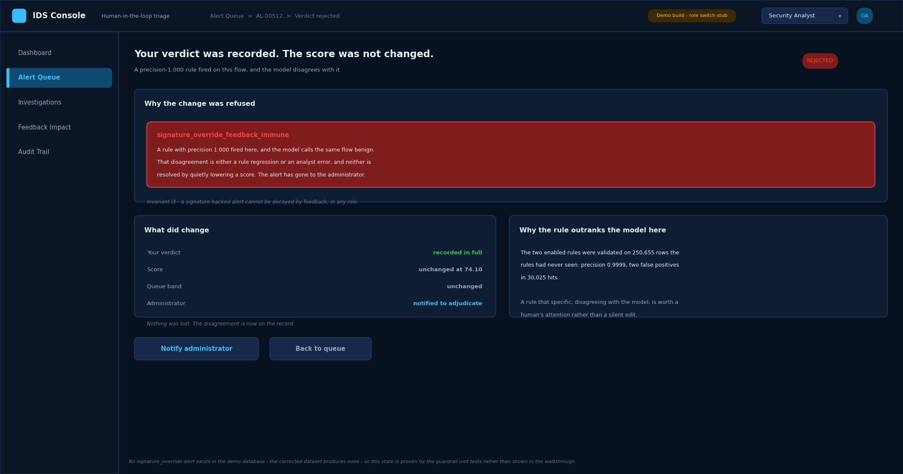

*This one screen is a design wireframe, not a screenshot: the demo dataset contains no alert that only
a signature rule flagged, so the refusal can never be triggered on it. The behaviour is covered by the
test suite.*

Some changes are refused rather than capped. Where a very high-precision rule has fired and the model
disagrees with it, feedback cannot lower the score at all — the disagreement is either a rule
regression or an analyst error, and neither is resolved by quietly editing a number. The alert goes to
the administrator instead, and the verdict is still recorded.

### (4.14) What your feedback taught the queue

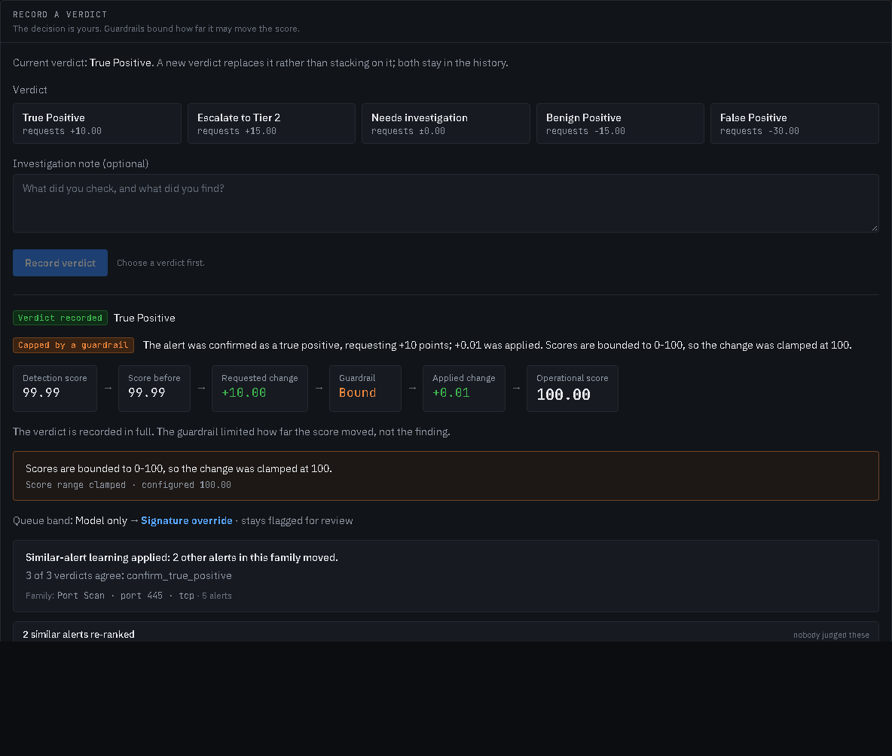

The project's central claim, made visible. Alerts are grouped into families by attack class,
destination port, protocol and matched rule. Once **three** agreeing verdicts are recorded in a family,
its learning is applied to the other members. Here the third True Positive in a Port Scan family moved
two alerts nobody had judged.

Learning that leaks past its family is not learning, it is drift: alerts outside the family do not
move. The caution is real and measured, though — because a family is a coarse key, the mechanism can
promote a benign alert along with its family.

### (4.15) Verdict history

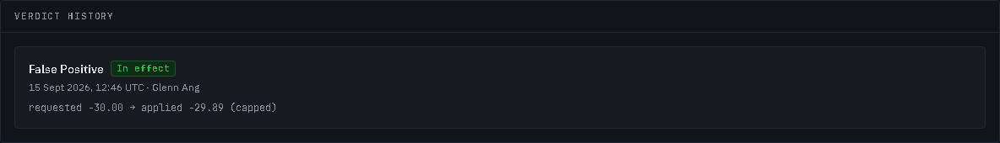

Every verdict ever recorded for an alert, oldest first, including the ones since replaced. Nothing is
edited and nothing is deleted; a correction is a new verdict that supersedes the old one, and both
remain visible.

### (4.16) Feedback impact

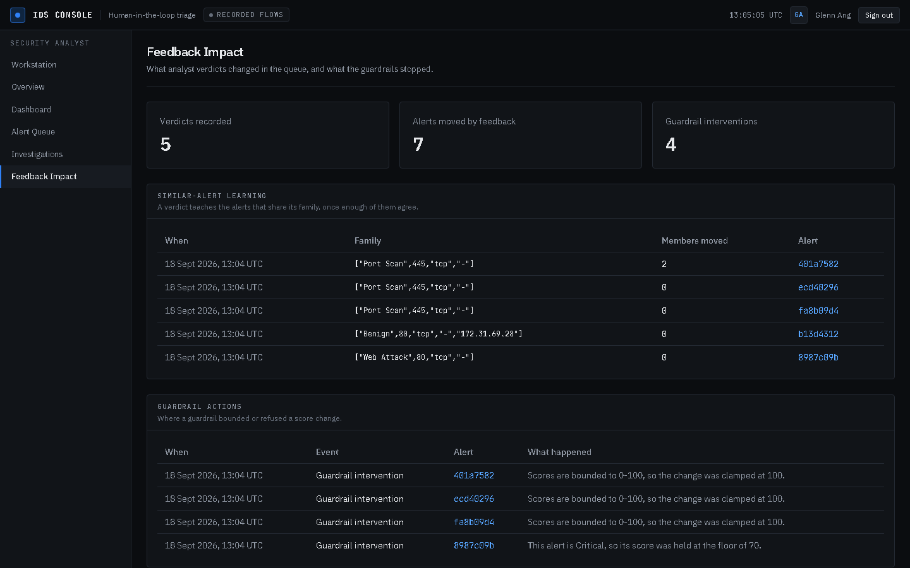

What the analysts' verdicts changed across the queue — which families learned and which alerts moved —
and what the guardrails stopped. The companion *Investigations* page lists every verdict recorded,
newest first.

### (4.17) Administrator — system status

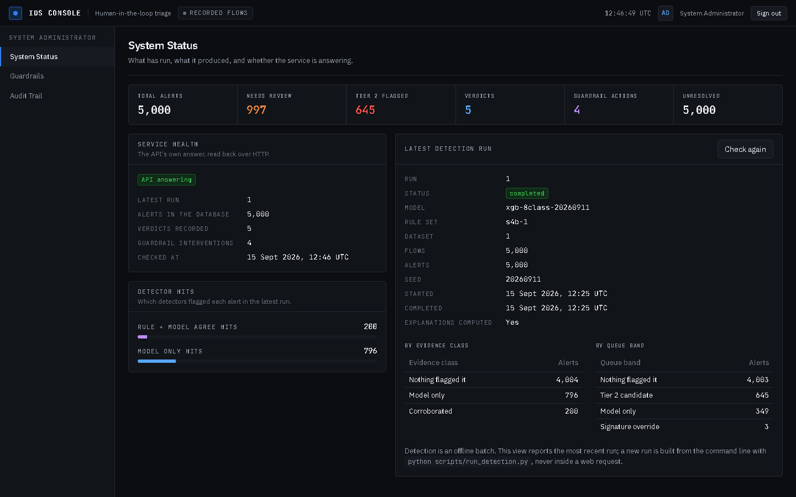

The administrator's landing view. A row of operations figures, whether the API is answering, which
detectors flagged the alerts of the latest run, and that run's provenance — model version, rule-set
version, dataset, seed — everything a replay would need. *Check again* reports the latest run; a new
run is built from the command line, never inside a web request.

### (4.18) Administrator — guardrail configuration

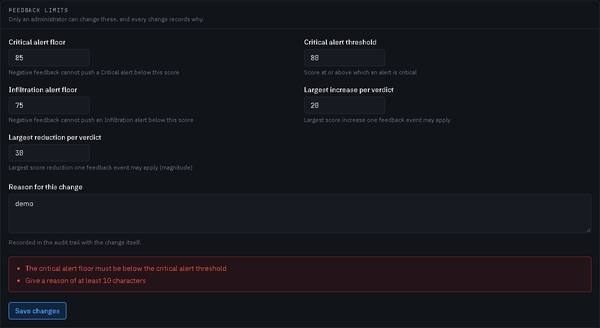

The five settings that bound what analyst feedback may do, each with its own explanation, and the
settings the pipeline enforces but feedback cannot move. A written reason is **required**, because the
audit entry should record why, not only what. The form refuses an inconsistent change before it is
sent — here a critical floor above the critical threshold.

### (4.19) Administrator — audit trail

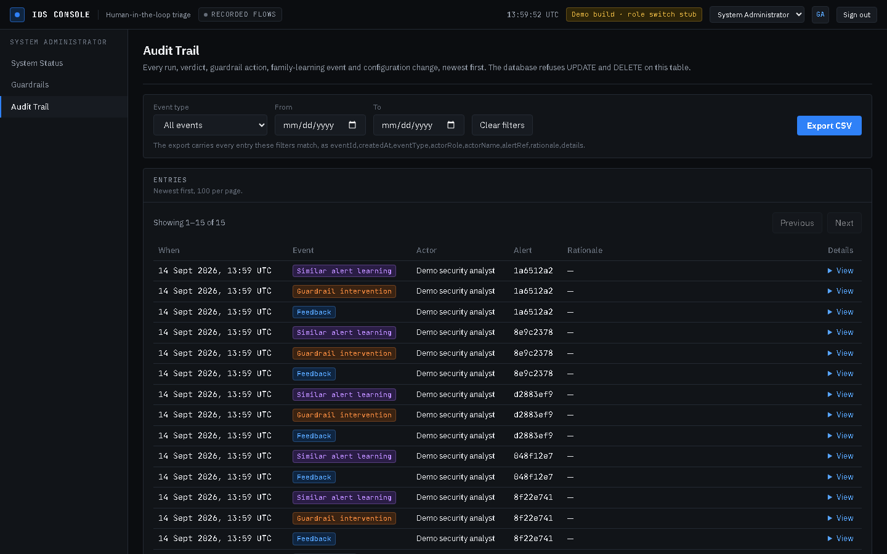

Every detection run, verdict, guardrail action, family-learning event, status change and configuration
change, newest first, filterable by type and date, and exportable as CSV. The table is append-only at
the database: `UPDATE` and `DELETE` both raise.

### (4.20) Evaluator — evaluation runs

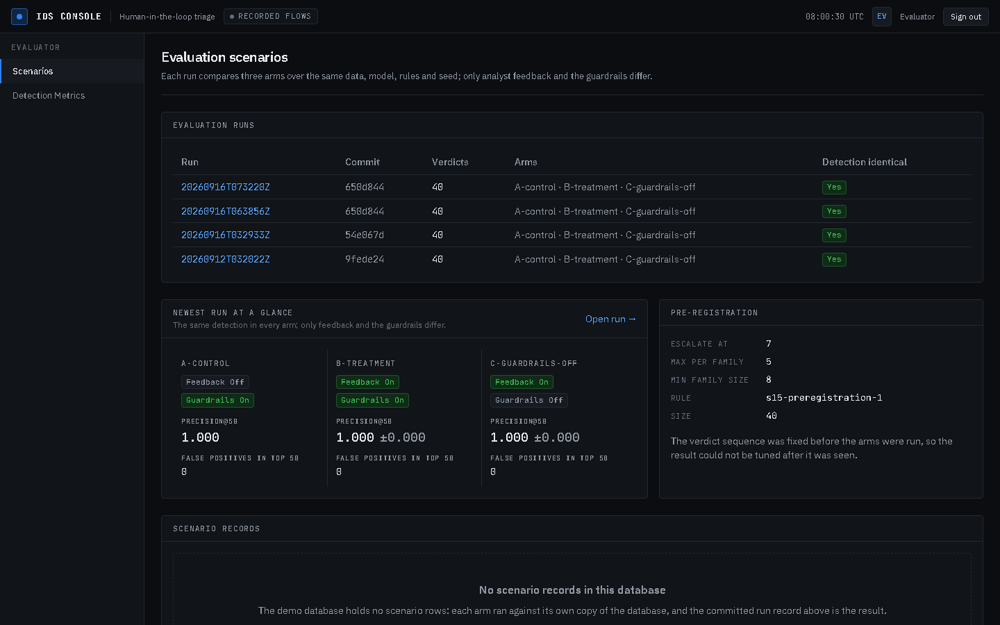

The evaluator's entry screen: the recorded three-arm runs, the newest run's three arms side by side,
and its pre-registration — the verdict sequence was fixed before any arm ran, so the result could not
be tuned after it was seen.

### (4.21) Evaluator — one run

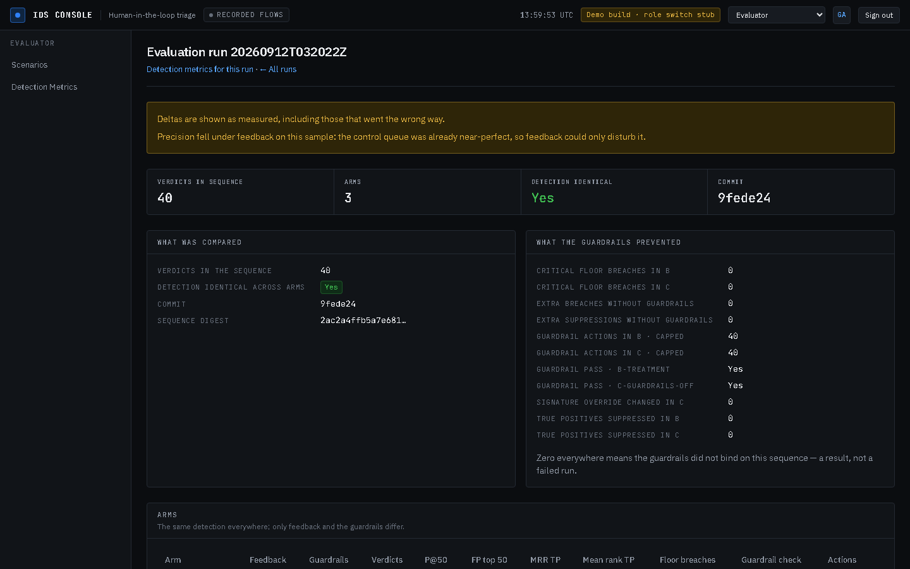

The reason the project can make claims rather than assertions. Three arms run over identical data,
model, rules and seed; only the feedback and the guardrails differ.

The deltas are shown **as measured, in whichever direction they went**. On this sample precision@50
fell from 1.000 to 0.980 under feedback, because the control queue was already almost perfect — and the
screen says so before the reader reaches the table.

### (4.22) Evaluator — detection metrics

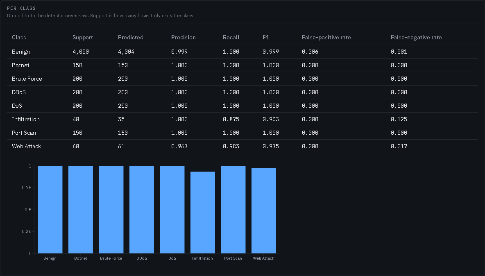

Per-class precision, recall, F1 and error rates, measured against ground truth that the system itself
never sees, with a panel per class so the imperfect ones — Infiltration and Web Attack — stand out.

Two cautions sit on the screen rather than in a footnote. *Score saturation* explains why a promotion
can have nowhere to go. And the headline macro F1 of 0.988 is flagged as a property of the test
dataset, where one tool generated each attack class, not a claim about real traffic.

---

## Reproducing the figures

The screenshots in section 4 are captured from the running console, not drawn by hand, so they stay
true as the system changes. From `hitl-ids/apps/web`, with `HITL_PYTHON` pointing at the project's
Python 3.11:

```
GUIDE_CAPTURE=1 npx playwright test capture-guide
```

This starts its own API on a disposable copy of the demo database, walks the demonstration, and writes
the images to `docs/img/demo-guide/`. The one wireframe (4.13) is generated from the database with
`python scripts/make_wireframes.py 09`.
