# Preliminary User Manual

**FYP-26-S3-13 — Human-in-the-Loop Intrusion Detection Dashboard**
CSIT321 Project · School of Computing and Information Technology

> **This file is the source; the submitted document is generated from it.** Edit the text here,
> then rebuild:
>
> `python scripts/build_user_manual.py`  ->  `docs/FYP-26-S3-13_PrelimUserManual.docx`
>
> Do not edit the `.docx` directly - the two would fork, and this project has already spent a
> session repairing documents that drifted apart. The cover page still needs the assessor,
> supervisor, topic code and team rows filled in; they appear as bracketed placeholders.

---

## Document control

| | |
|---|---|
| Title | Preliminary User Manual |
| Document name | FYP-26-S3-13 Preliminary User Manual, Version 0.1 |
| Status | Draft for team review |

### Record of revision

| Date | Description | Section affected | Changes made by | Version after revision |
|---|---|---|---|---|
| 12 Sep 2026 | First draft: introduction, installation, key features, and the sixteen initial GUIs | 1–4 | Glenn | 0.1 |

---

## (1) Introduction

This Preliminary User Manual takes a first-time user from a fresh clone to a running system, and then
through the screens they will actually use. It stays practical: install, first run, first verdict.

### (1.1) What this manual covers

- Initial installation on Windows and macOS.
- First-time configuration and building the demo database.
- A tour of the initial interface: the analyst queue, one alert's evidence, the feedback loop and its
  guardrails, and the administrator and evaluator views.

### (1.2) What we assume about the readers

- Basic familiarity with opening a terminal and running simple commands.
- The reader can clone a repository from GitHub and open it in an editor.
- No security-operations background is assumed. Where a term matters — *evidence class*, *queue
  band*, *guardrail* — the manual explains it at the point of use.

### (1.3) Scope and purpose

This project is a **network intrusion detection dashboard with a human in the loop**. Signature rules
and a machine-learning classifier score recorded network flows; an analyst reviews the resulting
alerts, and their verdicts re-rank future alerts inside safety limits the analyst cannot override.

This manual covers **initial installation, initial configuration, and the initial GUIs only**. It is
not a complete operator's guide.

> **One thing to be clear about up front.** The detection pipeline, the feedback loop, the
> guardrails, the persistence layer, the evaluation harness and the API are **built and tested**. The
> web interface is **in progress**. Section 4 therefore shows the *designed* screens as
> high-fidelity wireframes, with real values taken from the working system — every score, rule,
> feature name and guardrail figure in those images is read from the demo database, not invented.

---

## (2) The initial installation instructions

### (2.1) Prerequisites

**System requirements**

- **Python 3.11** — the project pins this version. Python 3.12 ships pandas 3, which changes date
  parsing, and has no matching `xgboost` wheel for this project's pin.
- **Git**, to clone the repository.
- Roughly **2 GB of free disk space** for the model, the sample data and the demo database.
- **Node.js 18+** — needed only for the web interface, which is still being built.

**Python packages** (installed from `pyproject.toml`)

| Package | Used for |
|---|---|
| `pydantic` >= 2.11 | the data contracts every component validates against |
| `xgboost` | the 8-class classifier |
| `scikit-learn`, `numpy`, `pandas` | training and evaluation |
| `fastapi`, `uvicorn` | the demo API |
| `pytest` | the test suite |

### (2.2) Backend set-up

Run these from the repository root.

**Windows (PowerShell)**

```
git clone https://github.com/CSIT-321/CSIT321-Human-in-the-loop_IDS.git
cd CSIT321-Human-in-the-loop_IDS\hitl-ids
py -3.11 -m venv .venv
.venv\Scripts\activate
pip install -e ".[dev]"
```

**macOS / Linux**

```
git clone https://github.com/CSIT-321/CSIT321-Human-in-the-loop_IDS.git
cd CSIT321-Human-in-the-loop_IDS/hitl-ids
python3.11 -m venv .venv
source .venv/bin/activate
pip install -e ".[dev]"
```

**Check the install before going further**

```
python -m pytest
```

Expect **376 passed, 0 skipped**. If any test is skipped, the interpreter is not 3.11.

**Build the demo database**

The database is not committed — it is 42 MB and fully regenerable. Build it once:

```
python scripts/run_detection.py
```

This scores 5,000 recorded flows through the signature rules, the model and the fusion layer, and
writes `data/demo.db`. It takes about **21 seconds** and prints a summary: 5,000 flows in, 5,000
alerts out.

**Run the API**

```
python -m uvicorn apps.api.main:app --reload
```

Then open **http://localhost:8000/docs** for the interactive API documentation, or
**http://localhost:8000/api/health** to confirm which database is being served.

### (2.3) Frontend set-up

The web interface is under construction. When it is ready:

```
cd apps/web
npm install
npm run dev
```

and open **http://localhost:5173**. The development server proxies `/api` to the backend on port
8000, so both run from one origin and no CORS configuration is needed.

Until then every screen in section 4 is reachable through the API, and the interactive documentation
at `/docs` will exercise each endpoint.

---

## (3) Key features

- **Two detectors, kept separate on purpose.** Signature rules give a checkable reason; the model
  gives coverage. Their outputs are never averaged — a rule's verdict and a probability are not the
  same kind of evidence, so the system reports which kind it has rather than blending them into one
  misleading number.
- **Every flow becomes an alert**, including the ones nothing flagged. They form the bottom of the
  queue and the denominator of every measurement.
- **A ranked queue, not a list.** Alerts sit in bands — Tier 2 candidate, corroborated, model-only,
  nothing-flagged — and are ordered within a band by score.
- **Explanations, not scores alone.** Every model prediction carries a TreeSHAP explanation naming
  the measurements that drove it. All 5,000 pass an additivity check, meaning the explanation
  accounts for the prediction exactly.
- **Analyst feedback that actually changes the queue.** A verdict adjusts the alert's operational
  score and — once three analysts agree — carries to the alerts like it.
- **Guardrails the analyst cannot override.** Caps on how far one verdict may move a score, floors
  under Critical and Infiltration alerts, and a rule that a signature-backed alert can never be
  decayed by feedback at all. Every intervention is shown to the analyst in words.
- **An append-only audit trail**, enforced by the database rather than by convention.
- **A three-arm evaluation** — no feedback, scripted feedback, and guardrails disabled — so every
  claim is a delta against a control rather than an assertion.
- **Three roles**: security analyst, system administrator, evaluator.

---

## (4) Initial GUIs of our project

The screens below are the designed interface. Values shown are real, read from `data/demo.db`.

### (4.1) Sign in and role selection

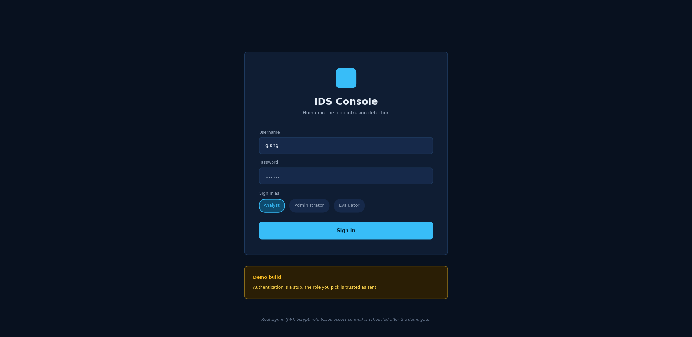

The first screen. The user enters a username and password and chooses which role to sign in as:
analyst, administrator or evaluator. The choice decides which views are available — only an
administrator can change the guardrail settings, for example.

Authentication in the demo build is deliberately a stub, and the screen says so: the role is trusted
as sent. Real sign-in with JWT tokens, password hashing and role-based access control is scheduled
after the demo.

### (4.2) Analyst dashboard

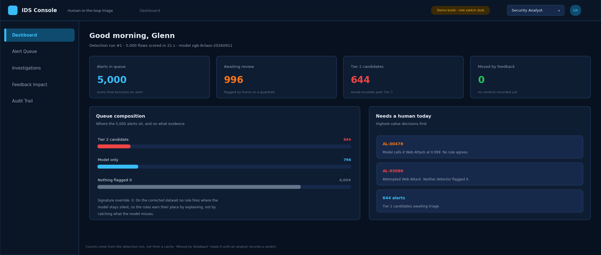

Where an analyst lands. Four counters summarise the current detection run: how many alerts exist, how
many are flagged for review, how many would escalate past Tier 1, and how many have been moved by
human feedback so far.

*Queue composition* shows where the alerts sit and on what evidence. *Needs a human today* lists the
highest-value decisions waiting. "Moved by feedback" reads **0** until somebody records a verdict — it
counts real movement, not the system's own initial placement.

### (4.3) The alert queue

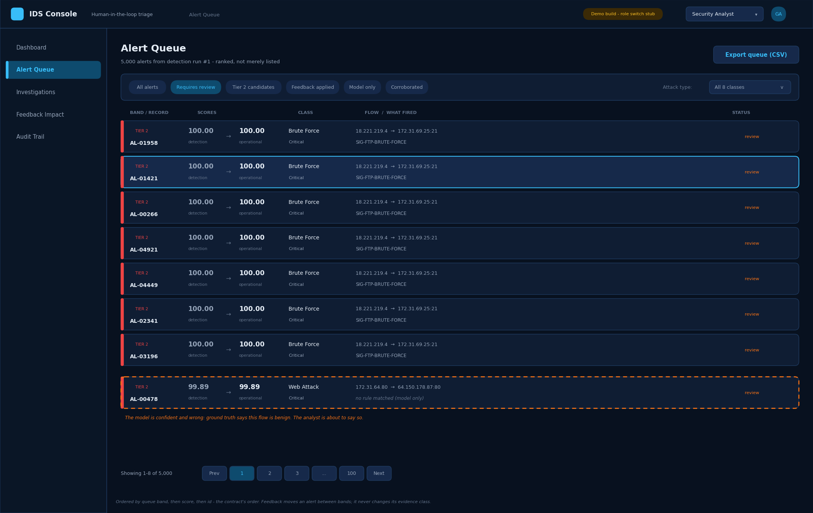

The analyst's main working view: 5,000 alerts, ranked. Each row shows the queue band, the alert
reference, **both score columns**, the predicted class, the flow, and which rule fired — or the words
*no rule matched (model only)*, which is the common case.

The two score columns matter. **Detection** is what the detectors produced and never changes.
**Operational** is what analyst feedback moves. Showing both is what makes the human's effect visible.

Filter chips narrow the queue; the attack-type dropdown filters by class. Ordering is fixed by
contract — band first, then score — so an alert promoted by feedback genuinely rises.

The highlighted row, `AL-00478`, is the one the demo opens on: the model calls it a Web Attack with
0.999 confidence, and it is in fact benign.

### (4.4) Alert detail — the four evidence panels

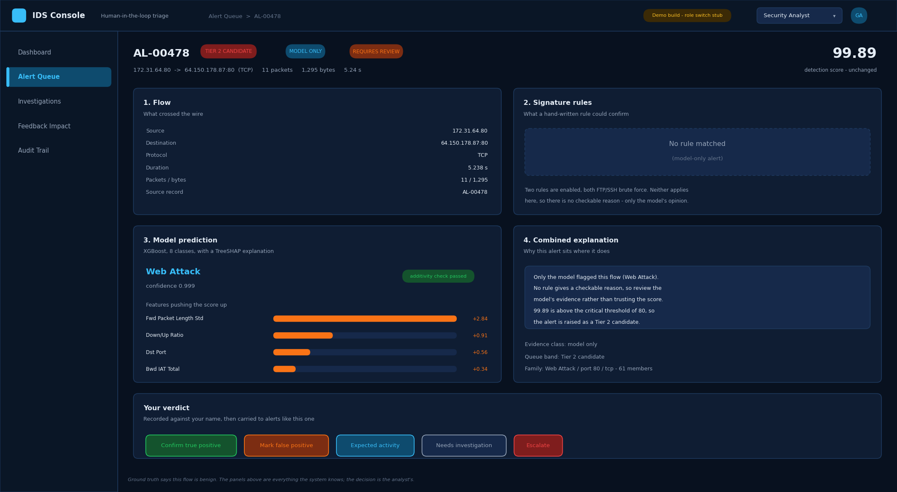

Everything the system knows about one alert, in four panels.

1. **Flow** — what actually crossed the wire.
2. **Signature rules** — what a hand-written rule could confirm. Here nothing matched, and the panel
   says so rather than showing an empty box.
3. **Model prediction** — the class, the confidence, and the measurements that drove it.
4. **Combined explanation** — why the alert sits where it does, in a sentence the analyst can repeat
   in a handover.

The verdict buttons run along the bottom. The decision is the analyst's; the panels exist to inform
it, not to make it.

### (4.5) Signature evidence

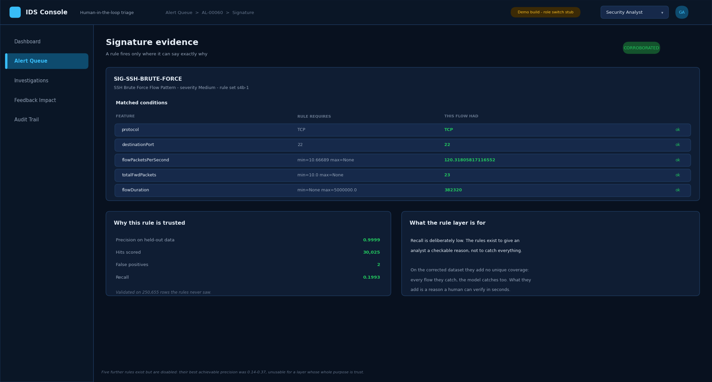

When a rule does fire, this is what it shows: every clause the rule requires, beside the value this
flow actually had. An analyst can check the match in seconds without trusting anything.

The right-hand panel is deliberately candid about what this layer is for. The rules have high
precision and low recall — they are there to give a *reason*, not to catch everything.

### (4.6) Model explanation

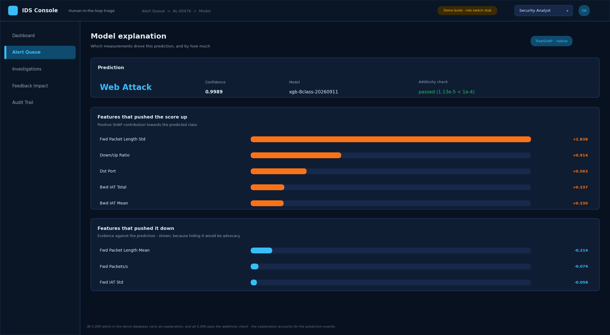

The model's reasoning, as far as it can be shown. Features that pushed the score up are listed with
their contributions, and — equally important — so are the features that pushed it **down**. Showing
only the supporting evidence would be advocacy rather than explanation.

The *additivity check* confirms that the explanation accounts for the prediction exactly.

### (4.7) Recording a verdict

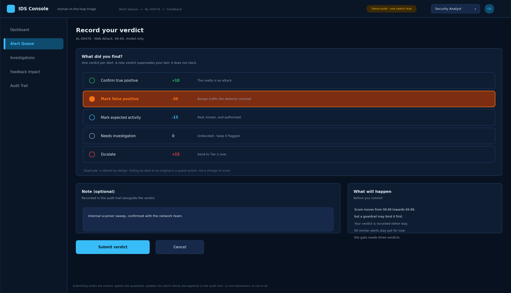

Five verdicts are available, each with the score change it requests. An optional note is recorded
alongside. The panel on the right states what will happen before the analyst commits.

One verdict per alert: a new verdict replaces the previous one rather than stacking on it.

### (4.8) The score adjustment chain

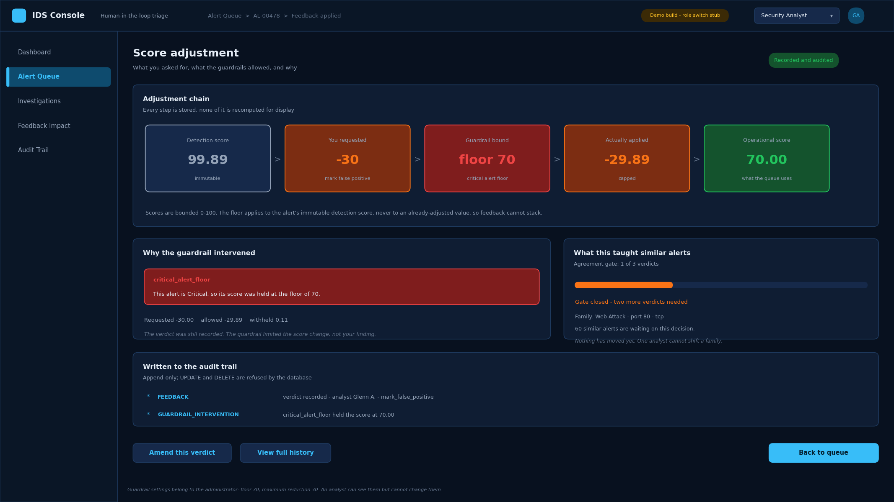

**The screen the project turns on.** It shows the whole chain — the detection score, what the analyst
requested, which guardrail bound the change, what was actually applied, and the resulting operational
score.

Here the analyst asked for −30. The alert is Critical, so the floor held it at 70, and the guardrail
explains itself in a sentence rather than a code. The verdict was still recorded in full: the
guardrail limited the *score change*, not the analyst's finding.

### (4.9) When a guardrail refuses outright


Some changes are refused rather than capped. Where a very high-precision rule has fired and the model
disagrees with it, feedback cannot lower the score at all — the disagreement is either a rule
regression or an analyst error, and neither is resolved by quietly editing a number. The alert goes
to the administrator instead.

The verdict is still recorded. Nothing is lost; the disagreement is now on the record.

### (4.10) What your feedback taught the queue

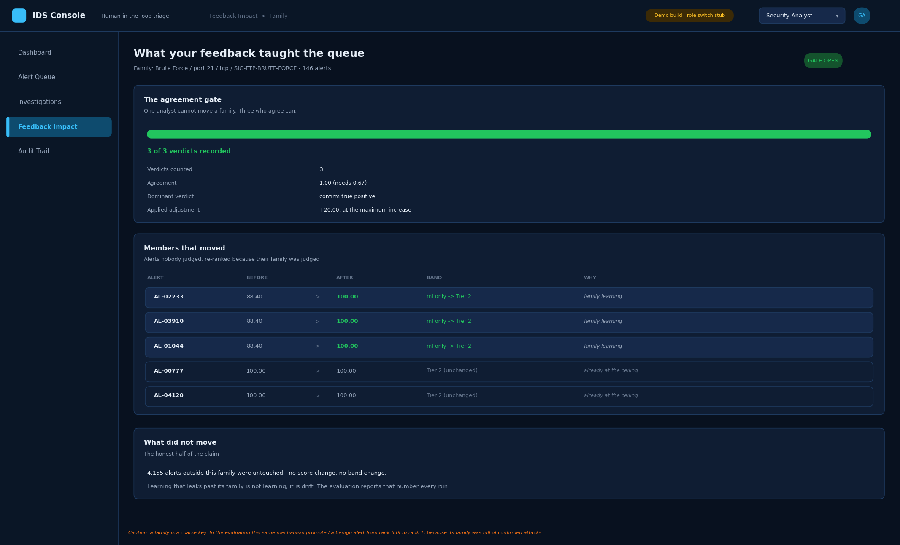

The project's central claim, made visible. Alerts are grouped into families by attack class,
destination port, protocol and matched rule. Once **three** analysts agree about a family, the
family's learning is applied to its other members — including alerts that arrive later.

The screen shows which members moved, which did not, and why. The last line is the honest half: over
4,000 alerts outside this family were untouched. Learning that leaks past its family is not learning,
it is drift.

The caution at the foot is real and measured: because a family is a coarse key, this mechanism can
promote a benign alert along with its family.

### (4.11) Verdict history

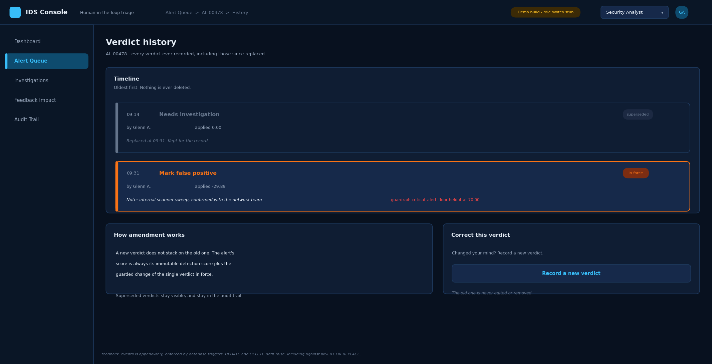

Every verdict ever recorded for an alert, oldest first, including the ones since replaced. Nothing is
edited and nothing is deleted; a correction is a new verdict that supersedes the old one, and both
remain visible.

### (4.12) Administrator — system status

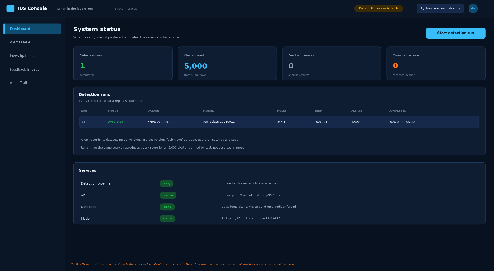

What has run and what it produced. Each detection run records the dataset, model version, rule-set
version, fusion configuration, guardrail settings and seed — everything a replay would need.

### (4.13) Administrator — guardrail configuration

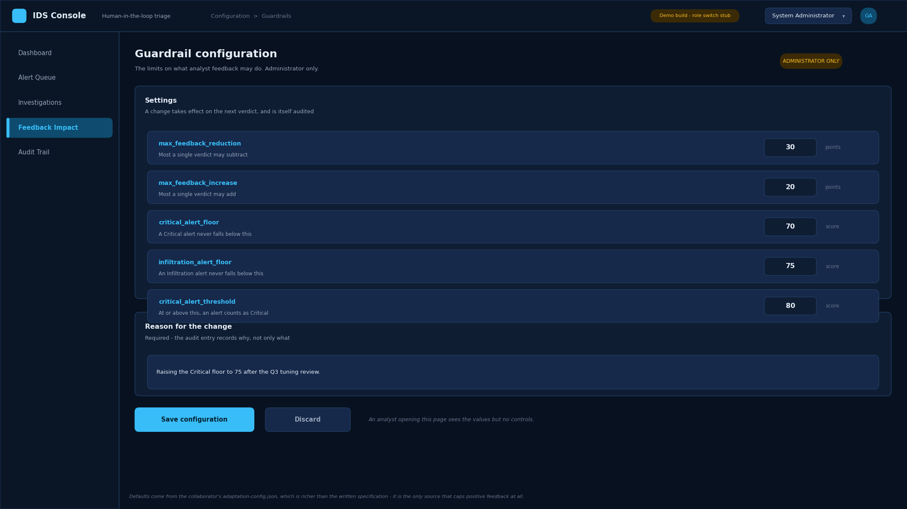

The five settings that bound what analyst feedback may do. Only an administrator sees the controls; an
analyst opening the same page sees the values and nothing to change.

A written reason is **required**, because the audit entry should record why, not only what.

### (4.14) Administrator — audit trail

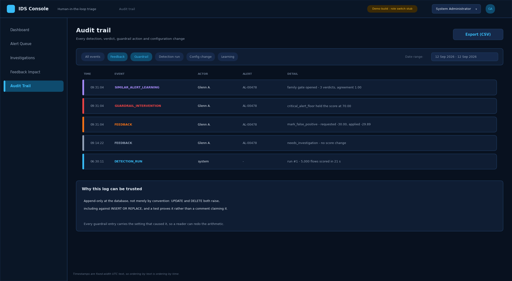

Every detection run, verdict, guardrail action, family-learning event and configuration change, newest
first, filterable and exportable.

The table is append-only at the database: `UPDATE` and `DELETE` both raise. Every guardrail entry
carries the setting that caused it, so a reader can redo the arithmetic.

### (4.15) Evaluator — three-arm evaluation

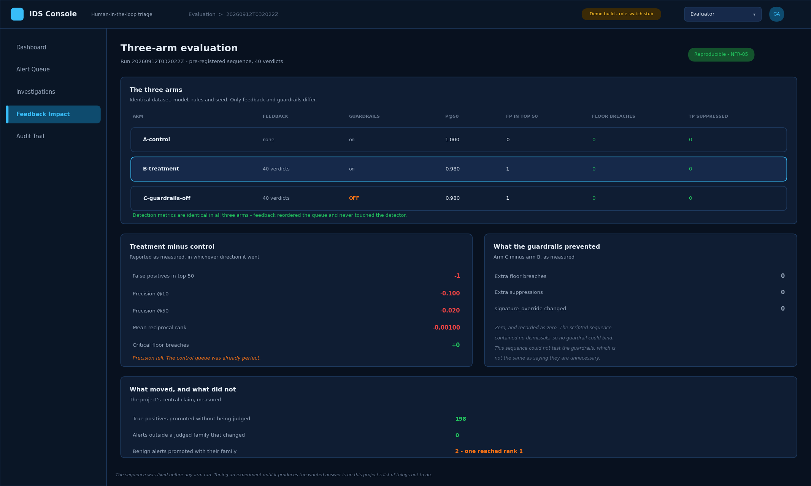

The evaluation view, and the reason the project can make claims rather than assertions. Three arms run
over identical data, model, rules and seed; only the feedback and the guardrails differ.

The deltas are shown **as measured, in whichever direction they went**. On this sample precision fell
under feedback, because the control queue was already almost perfect — and the screen says so rather
than hiding it.

### (4.16) Evaluator — detection metrics

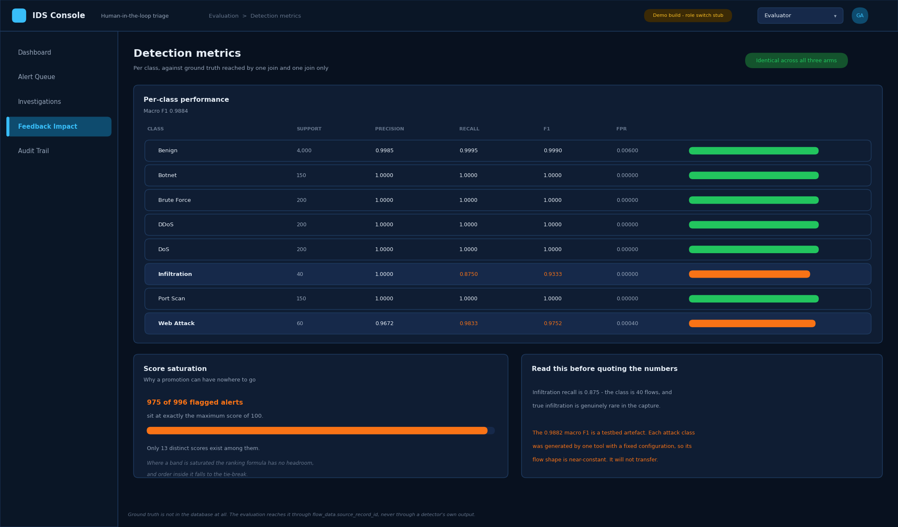

Per-class precision, recall, F1 and false-positive rate, measured against ground truth that the system
itself never sees.

Two cautions sit on the screen rather than in a footnote. *Score saturation* explains why a promotion
can have nowhere to go. And the headline F1 is flagged as a property of the test dataset, not a claim
about real traffic.

---

## Reproducing the figures

The screens in section 4 are generated, not drawn by hand, so they stay true as the system changes:

```
python scripts/make_wireframes.py            # all sixteen
python scripts/make_wireframes.py 03 08      # just these two
```

Every value is read from `data/demo.db` and from the committed evaluation run. Rebuild the database
first if a fresh clone reports it missing.
