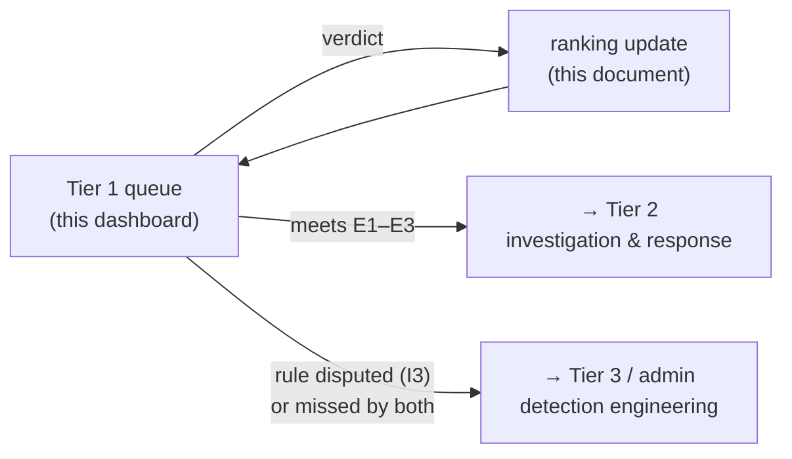

# Ranking & Escalation Design — How Feedback Moves Alerts

**Status:** proposal for decision · 2026-09-11 · responds to decisions **Q24–Q27**
**Owner:** Claude (feedback and ranking logic are never delegated) · **Feeds:** S7b, S15, S11

This document answers three questions the project lead raised:

1. How does a SOC's tiered workflow work, and how do we show which alerts would go to Tier 2?
2. How far should a confirmed alert rise, and how far should a false positive fall?
3. How should the *type* of attack change those distances?

It proposes a severity chart, four candidate ranking formulas drawn from game ranking systems,
and an experiment that **selects** the formula by measurement rather than by argument.

---

## 1. Decisions this responds to

| ID | Decision (project lead, 2026-09-11) |
|---|---|
| **Q24** | Feedback moves an alert into a **higher queue class**; a "flagged for review" view is an additional feature. The confirmed-missed-attack case (`AL-03086`) is documented for later consideration |
| **Q25** | Automatic escalation to the next SOC tier is **post-demo**. The demo must show we understand the SOC tier workflow and **show which alerts would be escalated** to Tier 2 |
| **Q26** | How far a confirmed alert moves is **decided by testing** candidate ranking systems, informed by game ranking design |
| **Q27** | Repeated false positives **drop a class**, by an amount that depends on the **type** of attack — via a numeric severity chart plugged into the movement formula |

---

## 2. The SOC tier model, and where this system sits

| Tier | Role | What they do |
|---|---|---|
| **Tier 1** — triage | Monitors the alert queue | Decides whether an alert is real or a false positive, enriches it, escalates genuine incidents |
| **Tier 2** — incident response | Takes escalated incidents | Deep investigation, containment, remediation |
| **Tier 3** — threat hunting / detection engineering | The most experienced analysts | Hunts advanced threats, forensics, **builds and fixes detections** |

**This system is Tier 1's tool.** The analyst queue is Tier 1's queue; each verdict is a Tier 1
triage decision. Two existing parts of the design already map onto the other tiers:

- **Tier 2:** alerts meeting the escalation criteria below get an **"→ Tier 2"** marker (demo: a
  recommendation only; post-demo: routing and a notification).
- **Tier 3:** a Tier 1 verdict that disputes a precision-1.000 rule (`signature_override`, invariant I3)
  is already routed to the administrator as a possible rule regression — detection-engineering work.
  So are the 6 attacks both detectors missed (rule development).

### Escalation criteria (proposal — thresholds to be tested in §6)

An alert is a **Tier 2 candidate** when any of these holds:

| # | Criterion | Why | Demo evidence |
|---|---|---|---|
| E1 | `corroborated` **and** Critical | A checkable rule and the model agree on a severe verdict | All 200 demo corroborated alerts are real attacks |
| E2 | Analyst verdict **escalate**, or **confirm** on an attack type of severity ≥ 7.0 (High) | A human confirmed something serious | — |
| E3 | Current score ≥ 90 **and** attack-type severity ≥ 7.0 | High confidence on a severe type | — |

`signature_override` never escalates to Tier 2 automatically — a disputed rule goes to Tier 3 first.

---

## 3. The severity chart

### How the numbers are anchored

Three published scales, combined so each number can be defended:

| Anchor | What it contributes |
|---|---|
| **Suricata classtype priority** (1 = most serious … 4) | An industry IDS's own ranking of attack classes |
| **MITRE ATT&CK tactic** | Kill-chain stage: the later the stage, the deeper the compromise |
| **CVSS v3.1 qualitative scale** | The 0–10 numeric scale and its bands: Low 0.1–3.9 · Medium 4.0–6.9 · High 7.0–8.9 · Critical 9.0–10.0 |

**Rule used:** start from the ATT&CK stage, raise one band for Suricata priority 1, and score an
*attempted* action below a *successful* one. The **weight** used by the formulas is `w = severity / 10`.

### The chart

| Attack type | ATT&CK tactic | Suricata classtype (priority) | Severity | Band | `w` | Our model detects it? |
|---|---|---|---:|---|---:|---|
| Benign traffic | — | not-suspicious (3) | 0.0 | None | 0.00 | yes — *Benign* |
| Policy violation / unwanted program | — | pup-activity (2) | 3.0 | Low | 0.30 | no |
| **Network / port scan** | TA0043 Reconnaissance, TA0007 Discovery | network-scan (3), attempted-recon (2) | **3.0** | Low | **0.30** | yes — *Port Scan* |
| **Brute-force login (attempted)** | TA0006 Credential Access | suspicious-login (2), default-login-attempt (2) | **5.0** | Medium | **0.50** | yes — *Brute Force* |
| Crypto-mining | TA0040 Impact (resource hijacking) | coin-mining (2) | 5.5 | Medium | 0.55 | no |
| **Denial of service** | TA0040 Impact | attempted-dos (2), denial-of-service (2) | **6.5** | Medium | **0.65** | yes — *DoS* |
| **Distributed denial of service** | TA0040 Impact | denial-of-service (2) | **7.5** | High | **0.75** | yes — *DDoS* |
| **Web application attack** (SQLi, XSS, command injection) | TA0001 Initial Access (exploit public-facing app) | web-application-attack (1) | **8.0** | High | **0.80** | yes — *Web Attack* |
| Exploit kit / shellcode | TA0002 Execution | exploit-kit (1), shellcode-detect (1) | 8.5 | High | 0.85 | no |
| Credential theft (successful) | TA0006 Credential Access | credential-theft (1) | 8.5 | High | 0.85 | no — success is label metadata, never a detector input |
| Privilege escalation | TA0004 Privilege Escalation | attempted-admin (1), successful-admin (1) | 9.0 | Critical | 0.90 | no |
| **Botnet / command and control** | TA0011 Command and Control | trojan-activity (1), command-and-control (1), domain-c2 (1) | **9.0** | Critical | **0.90** | yes — *Botnet* |
| **Infiltration / lateral movement** | TA0008 Lateral Movement | targeted-activity (1) | **9.5** | Critical | **0.95** | yes — *Infiltration* (weak: 317 flows) |
| Data exfiltration | TA0010 Exfiltration | successful-recon-largescale (2) | 9.5 | Critical | 0.95 | no |
| Destructive impact / ransomware | TA0040 Impact | — | 10.0 | Critical | 1.00 | no |

The bold rows are the model's eight classes and are what the formulas use today; the others make
the chart reusable when a richer dataset or the live flow exporter arrives. **The numbers are a
proposal for sign-off, not measurements** — the experiment in §6 tests how sensitive the ranking
is to them.

---

## 4. What game ranking systems teach

| System | Core mechanism | Lesson for alert ranking |
|---|---|---|
| **Elo** (chess) | Expected score `E_A = 1 / (1 + 10^((R_B − R_A)/400))`; update `R'_A = R_A + K·(S_A − E_A)`, with `S_A` = 1 win / 0.5 draw / 0 loss. `K` caps the change per game; FIDE uses 40 for new players, 20, then 10 for established top players | **Move in proportion to surprise.** Confirming an alert the system already rates near-certain should barely move it; confirming one it rated low should move it a lot. And K sets the maximum step |
| **Glicko-2** (Glickman) | Adds a **rating deviation** (RD) — uncertainty. High RD → larger changes; RD shrinks with evidence and grows with inactivity; volatility σ models erratic performance. Defaults: rating 1500, RD 350, σ 0.06 | **New patterns move fast, established ones slowly.** A family of alerts with few verdicts should respond strongly; one with many consistent verdicts should be stable |
| **TrueSkill** (Microsoft Research) | Skill is a Gaussian N(μ, σ²); players are ranked by the **conservative** estimate μ − 3σ | **Don't promote on thin evidence.** Rank by a cautious lower bound, not the optimistic mean |
| **Ranked ladders** (League of Legends) | Tiers and divisions; promotion at 100 LP; a **demotion-protection shield** after promotion (10 games into Bronze–Diamond, 3 into Master); **tier-loss protection** at the bottom of a tier | **Hysteresis prevents flapping.** It takes more to fall out of a class than to enter it — and some floors are absolute |

### The mapping

| Game concept | Alert-ranking analogue |
|---|---|
| Player | An **alert family** — similar alerts, by the collaborator's similarity fields: attack type, destination port, protocol, rule |
| Match result | An analyst verdict: **confirm / escalate = 1**, **false positive / expected activity = 0**; `needs_investigation` does not update |
| Expected score | The system's current belief: the judged alert's **current score ÷ 100** |
| K-factor | The largest movement one verdict can cause — **scaled by attack-type severity** (§3) |
| Rating deviation | How many verdicts the family has had: few → larger steps |
| Tier / division | The queue class |
| Demotion shield, tier-loss protection | Hysteresis on class changes; the Critical (70) and Infiltration (75) floors |

---

## 5. Candidate ranking formulas

All candidates keep the existing guardrails: a family's learned adjustment is bounded to
**−30 … +20** points, every alert's final score is **detection score + learned adjustment**, the
Critical and Infiltration floors hold, and a `signature_override` alert is frozen (I3).
`K = 30` points (equal to the guardrail's maximum reduction), `w` from §3.

| | Candidate | Movement per verdict | Character |
|---|---|---|---|
| **C0** | **Fixed step** — today's S7a engine | +10 confirm · −30 false positive · −15 expected · +15 escalate | Baseline. Ignores attack type and what the system already believed |
| **C1** | **Severity-weighted step** | up: `+K·w` · down: `−K·(1 − w)` | Severe types rise fast and fall slowly; mild types the reverse. Ignores surprise |
| **C2** | **Elo-style** | `Δ = K_dir · (S − E)`, with `E = score/100`, `K_up = K·(0.5 + 0.5w)`, `K_down = K·(1 − 0.5w)` | Moves in proportion to surprise, scaled by severity. **Self-limiting**: confirming a 100-point alert moves it 0 |
| **C3** | **Elo + uncertainty** (Glicko-lite) | C2 × `u`, with `u = 1/√(1 + n/3)` for a family with `n` prior verdicts (never below 0.4) | New families respond strongly; established ones settle — FIDE's falling K, Glicko's RD |

**Class movement** (Q24, Q27) is tested as a layer on top of any candidate:

| | Variant | Rule |
|---|---|---|
| **M1** | One class at a time, with hysteresis | Promote one class when a confirmed family's score crosses the class's entry threshold; demote one class only after the learned adjustment reaches a demotion threshold (a "demotion shield") |
| **M2** | Straight to the top | A confirmed or escalated alert moves directly to the Tier 2 candidate band |

The queue classes, top to bottom: **→ Tier 2 candidates** · `corroborated` · `signature_override` ·
`ml_only` · `none`. `evidence_class` itself never changes — it stays the permanent record of what
the detectors found; movement is a separate queue class.

### Worked numbers (C2, K = 30)

| Alert | Situation | Verdict | Calculation | C2 result | C0 result |
|---|---|---|---|---|---|
| `AL-03086` | Missed attempted Web Attack, 36.94 (`w` = 0.80) | confirm | `K_up` = 30 × 0.9 = 27; `Δ` = 27 × (1 − 0.369) = **+17.0** | **53.97** | 46.94 |
| `AL-00478` | Benign flow flagged as Web Attack, 99.89 (`w` = 0.80) | false positive | `K_down` = 30 × 0.6 = 18; `Δ` = 18 × (0 − 0.999) = **−18.0** | **81.91** | 70.00 (floor) |
| a port-scan family, 95 (`w` = 0.30) | benign scanner | false positive | `K_down` = 30 × 0.85 = 25.5; `Δ` = 25.5 × (0 − 0.95) = **−24.2** | **70.8** | 70.00 (floor) |
| `AL-00060` | Corroborated Brute Force, 100 | confirm | `E` = 1 → `Δ` = **0** | **100** | 100 (capped) |

The differences are exactly what Q27 asks for. A false positive on a **severe** type (Web Attack)
falls less than one on a **mild** type (port scan); a surprising confirmation rises further than the
flat +10; and confirming what the system already believed changes nothing.

---

## 6. The selection experiment — how the formula is chosen

**Data.** The demo sample in timestamp order: the first half is **calibration** (the analyst gives
verdicts), the second half is **future** traffic the analyst never sees. This is exactly the claim
being tested — feedback reorders *future* alerts — and matches the collaborator's held-out
calibration design. A second run on the 250,655-flow training sample gives larger families.

**Simulated Tier 1 analyst.** Reviews the top of the queue each round and gives the verdict ground
truth implies — with **0 %, 5 % and 15 % wrong verdicts**, because a system that learns from people
must survive people being wrong.

**Arms.** C0, C1, C2, C3 × M1, M2 × guardrails on / off (D9's third arm).

**Metrics, on the future half only:**

| Goal | Metric |
|---|---|
| **Triage efficiency** | Precision in the top 50 / 100 / 200; mean rank of true attacks; alerts reviewed before every attack is reached; repeated false positives in the top 100 (the TDM's before/after figure) |
| **Safety** | Critical alerts below the floor — must be **0**; true attacks demoted when the analyst is never wrong — must be **0** |
| **Stability** | Class changes per alert, especially at 15 % analyst error (flapping) |
| **Escalation** | Share of Tier 2 candidates that are real attacks; Tier 2 load |

**Selection rule.** The highest triage efficiency among arms with **zero safety violations** and
acceptable flapping; ties go to the simpler formula.

**Stated in advance:** on this testbed the detection scores are saturated (flagged alerts score
81.3–100) and each attack class is a near-constant fingerprint, so differences between formulas may
be small. That is reported, not hidden.

### Results — run `20260911T111625Z`

The full record is in `evaluation/ranking/`: `history.jsonl` has one line per run, and each run
folder holds `config.json`, `results.json` and `METHOD.md`. Read it in
`notebooks/05_ranking_selection.ipynb`, and rerun it with `python scripts/ranking_experiment.py`.

The caveat stated in advance held.

- **Precision in the top 100 is saturated.** The no-feedback control already scores 1.0 at 50, 100
  and 200, so every arm ties there. The rule above (*sel-1*, run `20260911T111249Z`) therefore fell
  through to its class-change tie-break. Its "winner", C1 + M2, is kept in the history but not adopted.
- ***sel-2*, written after seeing run 1**, ranks on the metrics that vary:
  1. safety;
  2. fewest true attacks demoted under analyst error (5 % + 15 %);
  3. Tier 2 precision at 5 %;
  4. mean attack position at 5 %;
  5. class changes;
  6. simplicity.

| Formula + movement | Attacks demoted under error | Tier 2 precision @ 5 % | Tier 2 load @ 5 % | Mean attack position @ 5 % |
|---|---|---|---|---|
| **C1 + M1** | **0** | **1.00** | 243 | 0.0828 |
| C1 + M2 | 0 | 0.74 | 504 | 0.1235 |
| C0 + M1 | 78.7 | 1.00 | 223 | 0.0828 |
| C0 + M2 | 78.7 | 0.74 | 484 | 0.1236 |
| C2 or C3 + M1 | 118 | 1.00 | 184 | 0.0845 |
| C2 or C3 + M2 | 118 | 0.73 | 471 | 0.2004 |
| *control, no feedback* | — | 1.00 | 243 | 0.0829 |

*These are means over 3 seeds. "Demoted" sums the 5 % and 15 % arms. No guarded arm let an alert
fall below the Critical floor.*

1. **Every demoted attack traces to one family, and a *correct* verdict caused it.** An earlier
   version of this section explained C2's demotions by the Elo form "trusting surprises". Tracing
   every demoted future attack with `experiment.calibrate` (notebook 05, §7 F2) contradicts that:
   - in every C0, C2 and C3 arm, at 5 % and at 15 % error, all the demoted attacks sit in one family,
     `('Web Attack', 80, 'TCP', '-')`;
   - the verdict that demoted them was **correct**: the analyst rightly dismissed one benign flow
     that the model had scored 99.89 as a Web Attack;
   - the family key (predicted class + port + protocol + rule) grouped that false positive with 59
     true Web Attacks in the future half. The dismissal cut their scores from 100 to 82 under C2,
     which is below the Tier 2 threshold of 90. The Critical floor of 70 never came into play.
2. **C1's "zero demoted" reflects coverage, not robustness.**
   - Under C1 the analyst never reviewed that benign flow, in any seed or at any error rate. C1's
     large confirmation steps reorder the queue so the flow is never reached in ten rounds.
   - C2 reaches it in every seed, and C0 in some.
   - No formula reaches it at 0 % error, which is why the effect showed up only "under analyst
     error": mistakes reshuffle the queue deeper.
   - **So the experiment does not separate the formulas on how they handle analyst error.**
   - C3's results are identical to C2's.
3. **Moving straight to the top (M2) lets one confirmation override any history.** This finding
   survives the trace.
   - In one seed, one wrong confirmation outweighed thirteen correct dismissals of a benign DNS
     family and lifted all 779 of its future flows into the Tier 2 band.
   - A second seed added 3 benign alerts, and the third none.
   - The 5 % mean (load 504, precision 0.74) is that rare but severe failure averaged over seeds.
   - Under M1, no single verdict can do this.
4. **Feedback does reach future traffic, but this sample leaves almost nothing to gain.**
   - 35–39 % of future flows belong to families learned during calibration. Finding 1 shows that
     this same reach also carries a verdict's harm.
   - The detectors already put nearly every attack at the top: the mean attack position is 0.0829
     with no feedback.
   - So the experiment cannot show an efficiency gain.

**Decision Q29, revised after the trace:**
- **Movement: M1.** Finding 3 supports it, and the demo's Tier 2 list depends on it (Q25).
- **Formula: not selected.** sel-2 names C1 + M1, but its deciding criterion was driven by one family
  collision (findings 1–2).
- **A requirement for S7b comes first: a single verdict must not move a whole family.**
  - The collaborator's adopted configuration (`stage-5/config/adaptation-config.json`, `aggregation`)
    applies a similar-alert adjustment only after **at least 3 learning verdicts with at least 0.67
    agreement** (0.80 counts as "strong"). This experiment learned from the first verdict.
  - Add that gate, plus a family key fine enough to keep an ML false positive apart from the attacks
    it resembles.
  - Then rerun, before choosing the formula.

---

## 7. Where this plugs in

| Piece | Step |
|---|---|
| Family ratings and learned adjustments — the formula chosen in §6 | **S7b** (similar-alert learning) |
| Severity chart as configuration, versioned and snapshotted into each detection run | S7b |
| Queue class and Tier 2 candidate marker on alerts — a small contract addition, cheap before S9 | S7b / S9 |
| The selection experiment | S7b, feeding S15's evaluation design |
| "→ Tier 2" marker and the "flagged for review" view on the dashboard | S11 – S12 |
| Automatic routing and notifications to Tier 2 | **Post-demo** (Q25) |

## 8. Decisions made, and what is still open

**Made (2026-09-11):**

1. **The severity chart is signed off** (Q27). **It must stay changeable** (Q28):
   - it lives in `config/severity-chart.json`, not in code;
   - it is versioned (`sev-1`) and validated whenever it is loaded (every model class exactly once);
   - every experiment run records the chart version it used.
2. **All four candidates are approved and tested** (§6).
   - The history of the tests and their method is kept locally in `evaluation/ranking/`.
   - It is read in notebook 05.
3. **The queue classes are confirmed**: Tier 2 candidates · corroborated · signature_override ·
   ml_only · none.
4. **M1 is selected; the formula is not** (Q29, revised — see §6 Results).

**Still open:**

- **The agreement gate and a finer family key**, followed by a rerun, before the formula is chosen
  (§6 Results, finding 1).

- **A stress test for the efficiency claim.** It needs a weaker or drifting detector, so that the top
  of the queue has false positives to learn from. Not yet run.
- **The run on the 250,655-flow training sample** planned in §6. SHAP predictions exist only for the
  demo sample. Not yet run.

---

## Sources

- Suricata classification types and priorities — [OISF `classification.config`](https://raw.githubusercontent.com/OISF/suricata/master/etc/classification.config)
- MITRE ATT&CK Enterprise tactics — [attack.mitre.org/tactics/enterprise](https://attack.mitre.org/tactics/enterprise/)
- CVSS v3.1 qualitative severity rating scale, §5 — [FIRST CVSS v3.1 specification](https://www.first.org/cvss/v3.1/specification-document)
- Elo rating system and FIDE K-factors — [Elo rating system](https://en.wikipedia.org/wiki/Elo_rating_system)
- Glicko-2 — Mark E. Glickman, [*Example of the Glicko-2 system*](http://www.glicko.net/glicko/glicko2.pdf)
- TrueSkill — Herbrich, Minka & Graepel, [*TrueSkill™: A Bayesian Skill Rating System*](https://www.microsoft.com/en-us/research/publication/trueskilltm-a-bayesian-skill-rating-system/); [TrueSkill project](https://www.microsoft.com/en-us/research/project/trueskill-ranking-system/)
- Ranked tiers, promotion and demotion protection — [League of Legends Wiki: Rank](https://wiki.leagueoflegends.com/en-us/Rank)
- SOC tiers — [Palo Alto Networks: SOC roles and responsibilities](https://www.paloaltonetworks.com/cyberpedia/soc-roles-and-responsibilities); [Radiant Security: Tier 1 vs Tier 2 vs Tier 3](https://radiantsecurity.ai/learn/soc-tier-1-vs-tier-2-vs-tier-3/)
