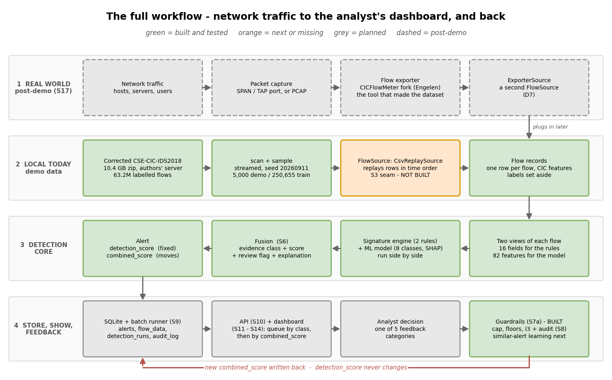
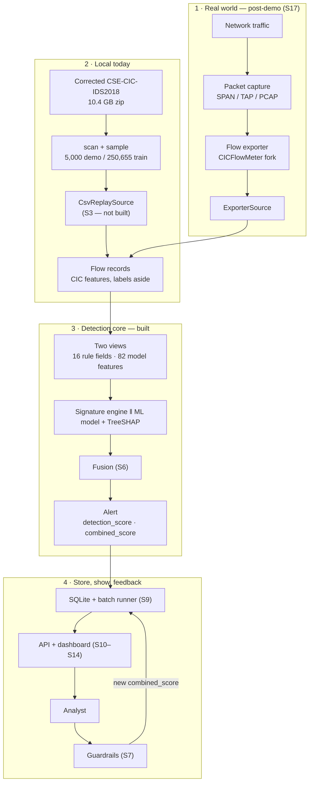
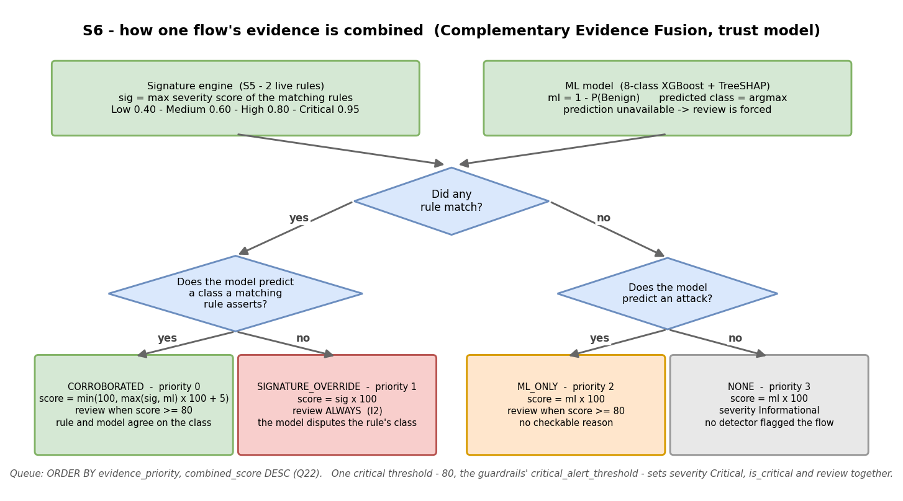
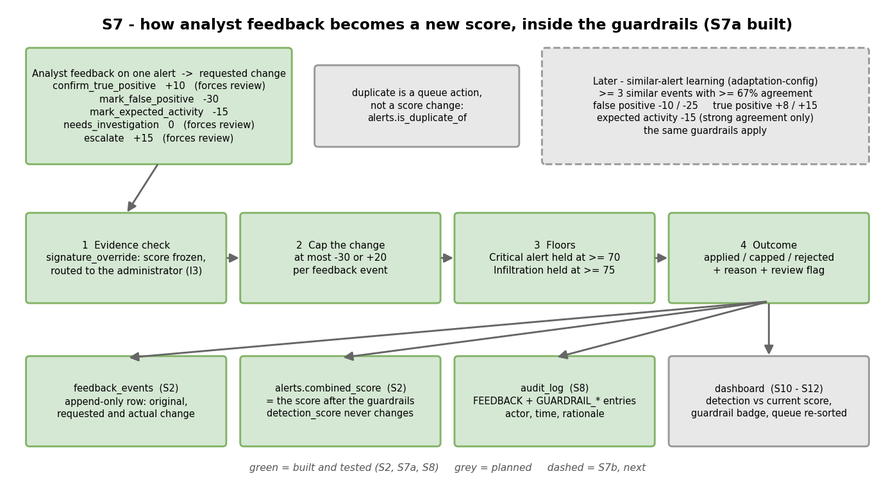
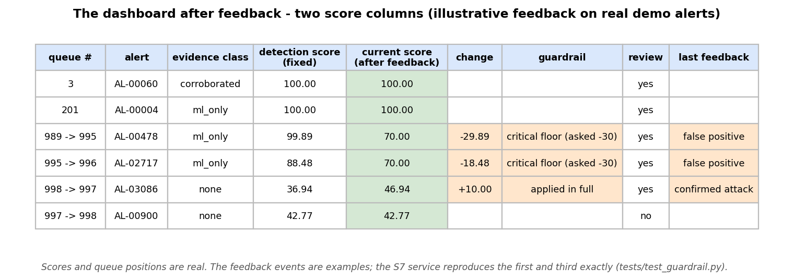

# System Workflow — From Network Traffic to the Dashboard, and Back

**As of:** 2026-09-11 · branch `feat/s6-fusion` · **Purpose:** one place that explains the whole
system as it stands — where flow data comes from, how it runs locally today, how the detection
score is built, and how analyst feedback, held inside the guardrails, produces the score the
dashboard shows. Every part is marked **built**, **next** or **planned**, so nothing designed is
mistaken for something that exists.

---

## 0. The short answers

**Is the signature + ML → detection score stage done?** The *logic* is done: it is implemented,
tested (22 fusion tests), and proven end to end on all 5,000 demo flows. What is not yet built is
the machinery around it — the batch runner that stores scored alerts (S9) and the screens that show
them (S10–S14).

| Part | Status |
|---|---|
| Signature engine + tuned rules (S5 + S4b) | **Built** |
| ML model + TreeSHAP explanations (Iteration 1) | **Built** |
| Combination into evidence class + score + review flag + explanation (S6) | **Built** |
| Storing alerts via a one-command batch run (S9) | Planned — needs S7 first |
| Replaying flows through a `FlowSource` interface (S3) | **Missing** — see §3 |
| Feedback + guardrails — direct verdicts (S7a) | **Built** (changelog v1.10) |
| Similar-alert learning (S7b) | Next |
| API and dashboard (S10–S14) | Planned |

**Does the combination need more tuning?** Not for the demo, and on this data tuning would change
nothing. Every flow a detector flags scores between **81.3 and 100**; every flow neither flags scores
between **0 and 42.77**; **no alert scores in between**. Any critical threshold from 42.78 to 81.3
therefore produces the identical queue, review flags and severities. The parameters are
configuration, not code, and each detection run records the values it used — so tuning later, on
realistic traffic, is a settings change. **Recorded as decision Q23:** the combination is accepted
for the demo at its current defaults (changelog v1.9).

---

## 1. The whole picture

Mermaid source (for viewers that render it)

The system reads as four lanes. Lanes 1 and 2 are two sources of the **same thing** — flow records
carrying the same CIC features — so everything from lane 3 down is identical whether the flows come
from a recorded dataset or a live network.

---

## 2. Lane 1 — Obtaining flow data in the real world *(post-demo)*

1. **Capture.** A switch's mirror port (SPAN), a network TAP, or a stored packet capture (PCAP)
   copies the traffic of the network being protected.
2. **Turn packets into flows.** A flow exporter groups packets into conversations and computes
   around 80 statistics per flow — duration, packet counts, byte rates, flag counts, timing.
   The chosen exporter is **the Engelen fork of CICFlowMeter** (decision D7), because it is the
   exact tool that produced the corrected dataset the model was trained on. Using it means live
   features are computed the same way as training features — no train/serve mismatch. Suricata was
   rejected because it cannot emit these features.
3. **Enter the system.** The flows arrive through a `FlowSource` — an `ExporterSource`, a second
   implementation of the interface that CSV replay uses today. Nothing downstream changes.

**Status:** post-demo (plan step S17). The project's approved scope treats live packet capture as
out of scope, so this lane is the designed path, not a demo commitment.

---

## 3. Lane 2 — How it runs locally today

| Step | What happens | Status |
|---|---|---|
| Acquire | The **corrected CSE-CIC-IDS2018** archive (Engelen et al., IEEE CNS 2022): 10.4 GB, 63.2M labelled flows, downloaded from the authors' server. It stands in for the exporter | Built |
| Sample | `build_samples.py` streams the zip (never extracted) into a **5,000-flow demo sample** (80% benign) and a **250,655-flow training sample**, seeded and disjoint | Built |
| Separate labels | Ground truth (`attack_class`, `Label`, `Attempted Category`) is set aside before detection and used only for evaluation. The data contract refuses label fields on a flow | Built |
| Replay | A `FlowSource` interface whose first implementation, `CsvReplaySource`, streams rows in time order as if from a sensor | **Missing** |

> **A gap found while writing this.** The plan's S3 specifies the `FlowSource` interface and
> `CsvReplaySource`, but neither exists in the code — scripts read the CSV directly. Plan Phase 1 was
> marked done on the dataset, samples and model. The S9 batch runner needs this interface, so it is
> built with S9.

Data and checksums: [`../data/README.md`](../data/README.md).

---

## 4. Lane 3 — How the detection score is layered

Each flow passes through six layers. Full formulas, charts and worked examples are in
[`iteration-2-report.md`](iteration-2-report.md) §4.

| # | Layer | What it produces |
|---|---|---|
| 1 | **Two views of the flow** | 16 observable fields for the rules; 82 features for the model |
| 2 | **Two detectors, side by side** | Signature engine: which of the 2 live rules match, with each condition's observed value → `sig` (0.60 for a Medium rule). ML model: one of 8 classes, `ml = 1 − P(Benign)`, and a TreeSHAP explanation |
| 3 | **Evidence class** | `corroborated` (rule and model agree on the class) · `signature_override` (the model disputes the rule) · `ml_only` · `none` |
| 4 | **Score** | corroborated `min(100, max(sig, ml)×100 + 5)` · override `sig×100` · ml_only / none `ml×100` |
| 5 | **Severity and flags** | One threshold, 80, sets severity *Critical*, `is_critical` and the review flag together; the override class is always reviewed |
| 6 | **Explanation and queue place** | A plain-language reason (the rule's checkable conditions + the model's strongest features); queue order by evidence class, then score |

**The output is two score fields on every alert:**

| Field | Meaning |
|---|---|
| `detection_score` | What the detectors concluded. Set once, when the alert is created, and **never changed** |
| `combined_score` | The operational score. Starts equal to `detection_score`; **feedback moves it** (§5) |

Keeping both is deliberate: the difference between them *is* the measurable effect of human
feedback, which is what the evaluation (S15) compares.

---

## 5. Lane 4 — Feedback and guardrails *(S7a built; similar-alert learning, S7b, next)*

The analyst's verdict on an alert becomes a new `combined_score` — but only through the guardrails,
whose job is to stop feedback from ever silencing a genuine threat. It is built as
`packages/detection/feedback/service.py` over `packages/detection/guardrail/policy.py`, ported from
the collaborator's engine (`stage-5/core/feedback-engine.js`), and one call does everything below
in a single transaction.

**Verdicts do not stack.** Each new verdict on an alert supersedes the previous one, and the
current score is always `detection_score` + the guarded change of the latest verdict — so a score
can never drift further than one capped change from what the detectors said.

### What the analyst can say

| Feedback | Requested change | Forces review | Values from |
|---|---:|---|---|
| `confirm_true_positive` | +10 | yes | `feedback-engine.js` |
| `mark_false_positive` | −30 | no | ″ |
| `mark_expected_activity` | −15 | no | ″ |
| `needs_investigation` | 0 | yes | ″ |
| `escalate` | +15 | yes | ″ |

`duplicate` is a queue action — it links the alert to its original (`alerts.is_duplicate_of`) —
not a score change.

### The guardrails, in order

1. **Evidence check.** A `signature_override` alert — a precision-1.000 rule the model disputes —
   keeps its score; the feedback is routed to the administrator as a possible rule problem (I3).
2. **Cap.** One feedback event may move the score by at most **−30** or **+20**.
3. **Floors.** A Critical alert cannot be pushed below **70**; an Infiltration alert not below **75**.
4. **Outcome.** Every event records the requested change, the change actually applied, and whether
   it was `applied`, `capped` or `rejected` — with the reason.

### What gets written

| Where | What | Status |
|---|---|---|
| `feedback_events` | One append-only row per verdict: original score, requested and actual change, guardrail action and reason | Table built (S2) |
| `alerts.combined_score` | The score after the guardrails | Column built (S2) |
| `alerts.detection_score` | Unchanged — always | Built (S2) |
| `audit_log` | `FEEDBACK` and `GUARDRAIL_*` entries with actor, time and rationale | Writer built (S8) |

**Later — similar-alert learning.** Once three or more analysts give the same verdict on similar
alerts with at least 67% agreement, the collaborator's design adjusts the similar alerts too
(false positive −10 / −25, true positive +8 / +15). The same guardrails apply.

### Worked examples on real demo alerts *(the first and third are reproduced exactly by `tests/test_guardrail.py`)*

| Alert | What it is | Verdict | Calculation | Result |
|---|---|---|---|---|
| `AL-00478` | Benign flow the model flagged as Web Attack, 99.89, Critical | false positive | 99.89 − 30 = 69.89 → below the Critical floor → **held at 70** | `combined_score` 70.00, actual change −29.89, *capped*; stays in review |
| `AL-02717` | Benign flow flagged as Web Attack, 88.48, Critical | false positive | 88.48 − 30 = 58.48 → **held at 70** | 70.00, actual −18.48, *capped* |
| `AL-03086` | Attempted Web Attack both detectors missed, 36.94 | confirm true positive | 36.94 + 10 = 46.94; within the cap, no floor | 46.94, *applied*; review now forced |
| any `signature_override` | Rule fired, model disputes it | false positive | frozen by I3 | score unchanged; routed to the administrator |

---

## 6. The dashboard — the second score column

The analyst's queue shows **both** scores side by side: what the detectors said, and where the
alert stands now. The change column and a guardrail badge make every adjustment visible and
explainable, and the queue re-sorts — `AL-00478` drops from position 989 to 995 after being
marked a false positive; `AL-03086` rises to the top of its band.

The collaborator's existing dashboard already has this concept, so its components can be reused
once they read our data:

| Our field | Collaborator's dashboard field |
|---|---|
| `detection_score` | `fusionRiskScore` |
| `combined_score` | `currentRiskScore` |
| `combined_score − detection_score` | `feedbackAdjustment` |
| guardrail codes | `feedbackGuardrailsApplied` |

Their dashboard also displays ground-truth fields (`groundTruth`, `trueAttackType`, `rawLabel`) —
those must go; an analyst in a human-in-the-loop evaluation must not see the answer key.

API endpoints behind it (S10): `GET /api/alerts` (queue order), `POST /api/alerts/{id}/feedback`
(the guardrail path — never delegated), `GET /api/alerts/{id}/score-adjustment`,
`GET /api/alerts/{id}/feedback-history`.

---

## 7. The S7 decisions — how they were settled

| # | Question | Outcome |
|---|---|---|
| 1 | Floors must never raise a score | **Decided and built.** A floor protects an alert only if it started at or above it. The collaborator's engine lifted a 60-point Infiltration alert *up* to 75 on a "false positive"; a test proves the port does not |
| 2 | "Critical" now means score ≥ 80 (legacy ≥ 90) | **Logged** (changelog v1.10). The Critical floor therefore protects every flagged demo alert |
| 3 | The engine's `uncertain` category | **Folded into `needs_investigation`** — identical effect (no change, forces review) |
| 4 | Feedback moves a score within its evidence band, never across bands, so a confirmed missed attack (`AL-03086`) stays in the bottom band | **Still open — a decision for the project lead.** The service sets its review flag, so a "flagged for review" dashboard view would surface it. Settle before S11 |
| 5 | A false positive among Critical alerts cannot fall below 70 | **Confirmed by test.** Clearing it from the queue is a *status* change (`resolved` / `dismissed`), not a score change |

Also settled in S7a: **I3 freezes a `signature_override` alert against every category** — the
plan's own test wording — and the feedback is logged as a `GUARDRAIL_REJECTION` for the
administrator. **Guardrails can be switched off** for the evaluation's third arm (D9); only the
0–100 range still binds.

---

## 8. Build status and the order of what comes next

| Order | Step | Delivers |
|---|---|---|
| ~~1~~ | ~~S7a direct feedback + guardrails~~ | **Done** — §5, changelog v1.10 |
| 1 | **S7b** similar-alert learning *(Claude only)* | One verdict adjusting similar alerts, inside the same guardrails |
| 2 | **S9** batch runner + the S3 `FlowSource` seam | One command: dataset → stored, scored alerts |
| 3 | **S15** evaluation design | The three seeded runs: no feedback · feedback · guardrails off |
| 4 | **S10a / S10b** API | The endpoints in §6 |
| 5 | **S11 – S14** interface | The analyst queue with both score columns; admin and evaluator views |
| 6 | **S16** demo gate | End-to-end demonstration |

---

## 9. Corrections made while writing this document

| What | Before | Now |
|---|---|---|
| `mark_expected_activity` change | HANDOVER said −30 | **−15**, read from `feedback-engine.js` |
| `duplicate` / `uncertain` in the engine | HANDOVER said `duplicate` appears nowhere | Both are present, each with no score change. The decision stands: `duplicate` is a queue action |
| The `FlowSource` seam | Assumed done with plan Phase 1 | Not built; moved into S9 |

---

## Related documents

- [`iteration-2-report.md`](iteration-2-report.md) — the fusion logic in full: formulas, charts, worked examples
- [`iteration-report.md`](iteration-report.md) — Iteration 1: the corrected dataset and why the design changed
- [`plan-changelog.md`](plan-changelog.md) — every decision with its evidence (Q23 in v1.9)
- [`HANDOVER.md`](HANDOVER.md) — current state for the next session
- [`../data/README.md`](../data/README.md) — the data and how to rebuild it
